# OFERTA NA SYSTEM ZARZĄDZANIA TRANSPORTEM PASAŻERSKIM

## 1. Wizja projektu 

Stworzyć kompleksowy system zarządzania transportem pasażerskim, który umożliwi przewoźnikom efektywne zarządzanie ofertą i operacjami, automatyzując procesy od planowania rozkładów, przez sprzedaż biletów i monitoring ruchu, aż po weryfikację uprawnień i raportowanie finansowe. System zapewni pełną cyfryzację dzięki portalowi dla pasażerów, zaawansowanemu modułowi zarządzania dla przewoźników oraz narzędziom mobilnym dla pracowników terenowych.

---

## 1.1. Aktorzy w systemie 

### 1. Pasażer
**Opis roli:** Główny użytkownik końcowy systemu, korzystający z usług transportowych oferowanych przez przewoźników.

* **Cele:**
    * Szybkie znalezienie optymalnego połączenia (czas, cena, przesiadki).
    * Wygodny zakup biletów u wielu przewoźników w ramach jednej płatności.
    * Monitorowanie podróży w czasie rzeczywistym i otrzymywanie powiadomień o utrudnieniach.
    * Wybór konkretnego miejsca w pociągu dla zwiększenia komfortu.
* **Interakcje z systemem:**
    * Wyszukiwanie połączeń i przeglądanie rozkładów jazdy.
    * Zarządzanie koszykiem zakupowym i realizacja płatności.
    * Wybór miejsc na interaktywnym planie wagonu.
    * Odbieranie powiadomień push/SMS o opóźnieniach i komunikatów specjalnych.
    * Okazywanie kodu QR biletu do kontroli.
* **Charakterystyka:** Użytkownik mobilny, oczekujący szybkości działania (wyniki < 2-3 s) oraz przejrzystości informacji o cenach i zniżkach.

---

### 2. Przewoźnik
**Opis roli:** Podmiot biznesowy dostarczający usługi transportowe, odpowiedzialny za ofertę i dane operacyjne.

* **Cele:**
    * Zarządzanie ofertą przewozową (trasy, cenniki, klasy).
    * Utrzymywanie aktualności rozkładów jazdy.
    * Analiza efektywności sprzedaży i kontroli biletów poprzez raportowanie.
* **Interakcje z systemem:**
    * Edycja i aktualizacja rozkładów jazdy (wymaga uwierzytelnienia).
    * Definiowanie nowych tras, cenników i dostępnych klas biletów.
    * Generowanie i pobieranie raportów (CSV/PDF) dotyczących przychodów i obciążenia ruchu.
    * Monitorowanie ewentualnych konfliktów czasowych na swoich liniach.
* **Charakterystyka:** Użytkownik profesjonalny, kładący nacisk na integralność danych, bezpieczeństwo (autoryzacja) oraz analitykę biznesową.

---

### 3. Dyspozytor
**Opis roli:** Pracownik operacyjny odpowiedzialny za bieżący nadzór nad ruchem pociągów i komunikację kryzysową.

* **Cele:**
    * Bieżący monitoring pozycji pociągów w celu zapewnienia płynności ruchu.
    * Szybkie informowanie pasażerów o awariach i zmianach organizacyjnych.
* **Interakcje z systemem:**
    * Korzystanie z mapy geolokalizacyjnej (GPS/GSM) pociągów.
    * Analiza parametrów pociągu (prędkość, opóźnienie, status sygnału).
    * Wprowadzanie komunikatów specjalnych i informacji o awariach przypisanych do linii/stacji.
* **Charakterystyka:** Wymaga dostępu do danych w czasie rzeczywistym (odświeżanie co 60 s lub częściej) oraz narzędzi do natychmiastowego rozgłaszania informacji.

---

### 4. Kontroler
**Opis roli:** Pracownik terenowy odpowiedzialny za weryfikację uprawnień pasażerów do przejazdu.

* **Cele:**
    * Błyskawiczna weryfikacja ważności biletów w różnych warunkach oświetleniowych.
    * Wykrywanie nadużyć (duplikaty, brak dokumentów do zniżek).
* **Interakcje z systemem:**
    * Skanowanie kodów QR (skupienie na wydajności < 200 ms).
    * Praca w trybie offline z lokalną bazą danych.
    * Rejestrowanie incydentów (np. próba użycia duplikatu biletu).
    * Przeglądanie historii skanowań na urządzeniu mobilnym.
* **Charakterystyka:** Pracuje w dynamicznym środowisku (często bez dostępu do sieci), potrzebuje bardzo czytelnych komunikatów wizualnych (kodowanie kolorami).

---

## 1.2. Przypadki użycia 

### 1.2.1 Rozkład jazdy i planowanie podróży

**Diagram przypadków użycia:**

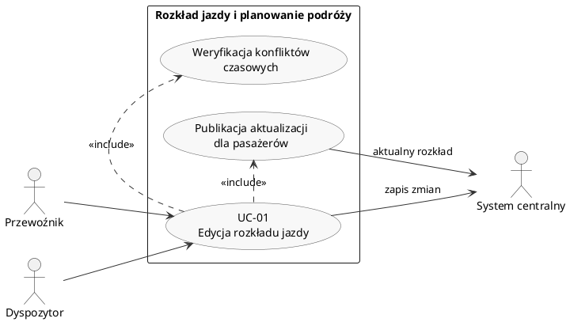
```plantuml
@startuml
left to right direction

skinparam packageStyle rectangle
skinparam usecase {
  BackgroundColor #F8F8F8
  BorderColor #555555
  ArrowColor #333333
}

actor "Przewoźnik" as Przewoznik
actor "Dyspozytor" as Dyspozytor
actor "System centralny" as SystemCentralny

rectangle "Rozkład jazdy i planowanie podróży" {
  usecase "UC-01\nEdycja rozkładu jazdy" as UC01
  usecase "Weryfikacja konfliktów\nczasowych" as Konflikty
  usecase "Publikacja aktualizacji\ndla pasażerów" as Publikacja
}

Przewoznik --> UC01
Dyspozytor --> UC01
UC01 .> Konflikty : <<include>>
UC01 .> Publikacja : <<include>>
UC01 --> SystemCentralny : zapis zmian
Publikacja --> SystemCentralny : aktualny rozkład
@enduml
```

#### UC-01: Edycja rozkładu jazdy

**Powiązana historia użytkownika:**  
Jako przewoźnik chcę edytować rozkład jazdy, aby zmiany były natychmiast widoczne w systemie.

**Główny aktor:**  
Przewoźnik / Dyspozytor

**Warunki wstępne:**

- Użytkownik jest zalogowany do systemu z odpowiednimi uprawnieniami.
- Nastąpiła potrzeba zmiany rozkładu jazdy, np. awaria, zamknięcie toru, zmiana operacyjna lub korekta planu kursowania.
- System posiada aktualne dane rozkładowe oraz informacje o trasach i kursach.

**Przepływ główny:**

1. Użytkownik wybiera w systemie opcję edycji rozkładu jazdy.
2. System wyświetla listę aktywnych tras, kursów i pociągów.
3. Użytkownik wyszukuje i wybiera kurs wymagający zmiany.
4. System wyświetla aktualny rozkład jazdy dla wybranego kursu.
5. Użytkownik edytuje parametry rozkładu, np. godzinę odjazdu, godzinę przyjazdu, opóźnienie, objazd lub pominięcie stacji.
6. System weryfikuje zmodyfikowany rozkład pod kątem konfliktów czasowych na tej samej linii.
7. Użytkownik zatwierdza zmiany.
8. System zapisuje zmianę w bazie danych wraz z datą i autorem modyfikacji.
9. System publikuje aktualizację rozkładu tak, aby była widoczna dla pasażerów w czasie poniżej 60 sekund.

**Przepływy alternatywne:**

**A1: Wykrycie konfliktu w rozkładzie**

1. System wykrywa konflikt czasowy na tej samej linii.
2. System blokuje zapis zmiany.
3. System informuje użytkownika o przyczynie konfliktu.
4. Użytkownik koryguje dane i ponawia próbę zapisu.

**A2: Całkowite odwołanie kursu**

1. Użytkownik zamiast edycji trasy oznacza kurs jako odwołany.
2. System usuwa kurs z aktywnych rozkładów.
3. System zapisuje informację o odwołaniu kursu.
4. System publikuje zmianę w systemie pasażerskim.

**Warunki końcowe:**

- **Sukces:** Rozkład jazdy zostaje zaktualizowany, a zmiana jest widoczna dla pasażerów w czasie poniżej 60 sekund.
- **Błąd:** Rozkład jazdy nie zostaje zmieniony, a użytkownik otrzymuje informację o przyczynie niepowodzenia.

---

### 1.2.2 Sprzedaż biletów i rezerwacja miejsc

**Diagram przypadków użycia:**

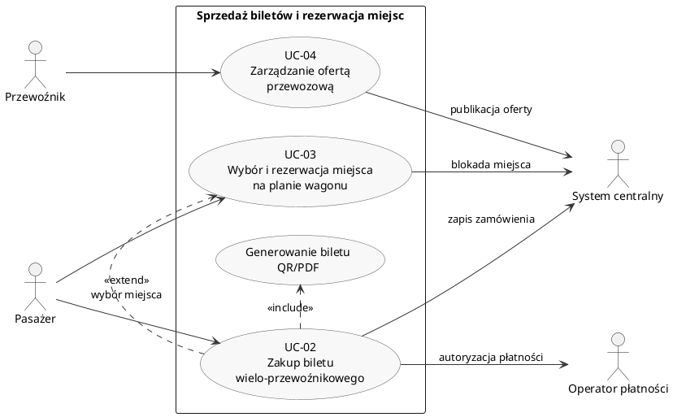
```plantuml
@startuml
left to right direction

skinparam packageStyle rectangle
skinparam usecase {
  BackgroundColor #F8F8F8
  BorderColor #555555
  ArrowColor #333333
}

actor "Pasażer" as Pasazer
actor "Przewoźnik" as Przewoznik
actor "Operator płatności" as OperatorPlatnosci
actor "System centralny" as SystemCentralny

rectangle "Sprzedaż biletów i rezerwacja miejsc" {
  usecase "UC-02\nZakup biletu\nwielo-przewoźnikowego" as UC02
  usecase "UC-03\nWybór i rezerwacja miejsca\nna planie wagonu" as UC03
  usecase "UC-04\nZarządzanie ofertą\nprzewozową" as UC04
  usecase "Generowanie biletu\nQR/PDF" as GenerowanieBiletu
}

Pasazer --> UC02
Pasazer --> UC03
Przewoznik --> UC04
UC02 .> UC03 : <<extend>>\nwybór miejsca
UC02 .> GenerowanieBiletu : <<include>>
UC02 --> OperatorPlatnosci : autoryzacja płatności
UC02 --> SystemCentralny : zapis zamówienia
UC03 --> SystemCentralny : blokada miejsca
UC04 --> SystemCentralny : publikacja oferty
@enduml
```

#### UC-02: Zakup biletu wielo-przewoźnikowego

**Powiązana historia użytkownika:**  
Jako pasażer chcę kupić bilet u wielu przewoźników w jednej transakcji, aby ułatwić podróż wielo-przewoźnikową.

**Główny aktor:**  
Pasażer

**Warunki wstępne:**

- Pasażer wyszukał połączenie w wyszukiwarce.
- Wybrane połączenie składa się z co najmniej jednego odcinka trasy.

**Przepływ główny:**

1. Pasażer dodaje wybrane połączenie, które może zawierać wielu przewoźników, do koszyka.
2. System wyświetla podsumowanie koszyka z listą wszystkich odcinków i łączną kwotą.
3. Pasażer wybiera opcję „Przejdź do płatności”.
4. System przekierowuje pasażera do zewnętrznego operatora płatności.
5. Pasażer dokonuje płatności za całe zamówienie.
6. System otrzymuje potwierdzenie autoryzacji płatności.
7. System generuje jeden zbiorczy bilet elektroniczny lub pakiet biletów pod jednym identyfikatorem.
8. System wysyła bilet na adres e-mail pasażera i zapisuje go na jego koncie.

**Przepływy alternatywne:**

**A1: Nieudana autoryzacja płatności**

1. System otrzymuje informację o odrzuceniu transakcji.
2. System wyświetla komunikat o błędzie płatności.
3. System umożliwia ponowną próbę płatności lub powrót do koszyka.

**A2: Wygaśnięcie sesji lub rezerwacji w trakcie płatności**

1. Pasażer zwleka z płatnością zbyt długo.
2. System informuje o wygaśnięciu czasu na zakup.
3. System zwalnia zablokowane miejsca lub bilety.
4. Pasażer zostaje przekierowany do strony głównej wyszukiwarki.

**A3: Błąd komunikacji z API jednego z przewoźników**

1. System nie może potwierdzić rezerwacji u jednego z partnerów.
2. System automatycznie inicjuje zwrot środków, jeśli zostały pobrane.
3. Pasażer otrzymuje komunikat o braku możliwości wystawienia biletu zbiorczego.
4. System informuje pasażera o konieczności kontaktu z biurem obsługi.

**Warunki końcowe:**

- **Sukces:** Pasażer posiada ważny dokument podróży, np. plik PDF lub kod QR, środki zostały przekazane przewoźnikom, a transakcja widnieje w historii zamówień.
- **Błąd:** Środki nie zostają pobrane albo zostają zwrócone, a miejsca w pociągach pozostają wolne w systemie sprzedaży.

---

#### UC-03: Wybór i rezerwacja miejsca na planie wagonu

**Powiązana historia użytkownika:**  
Jako pasażer chcę wybrać miejsce na planie wagonu, aby dopasować komfort podróży.

**Główny aktor:**  
Pasażer

**Warunki wstępne:**

- Pasażer jest w procesie zakupu biletu, przed płatnością.
- Przewoźnik udostępnia interaktywny plan składu pociągu.

**Przepływ główny:**

1. Pasażer wybiera opcję „Wybierz miejsce” przy konkretnym kursie.
2. System wyświetla interaktywny schemat składu pociągu z podziałem na wagony i klasy.
3. System oznacza miejsca zajęte jako nieaktywne, a miejsca wolne jako możliwe do wyboru.
4. Pasażer klika ikonę wybranego wolnego miejsca.
5. System wizualnie zatwierdza wybór i przypisuje numer miejsca do biletu w koszyku.
6. Pasażer zatwierdza wybór przyciskiem „Potwierdź wybór miejsc”.
7. System czasowo blokuje wybrane miejsca na czas trwania transakcji.
8. Po sfinalizowaniu płatności system trwale rezerwuje miejsca i nanosi ich numery na bilet.

**Przepływy alternatywne:**

**A1: Brak dostępności miejsc obok siebie dla biletów grupowych**

1. System informuje o braku wolnych miejsc w wybranym wagonie.
2. Pasażer zmienia wagon za pomocą nawigacji w schemacie składu.

**A2: Miejsce zajęte w ostatniej chwili**

1. W momencie kliknięcia w ikonę miejsca inny użytkownik zdążył już zablokować to miejsce.
2. System odświeża status miejsca na „zajęte”.
3. System wyświetla komunikat o konieczności wyboru innego fotela.

**A3: Przewoźnik nie udostępnia graficznego planu**

1. System zamiast mapy wyświetla listę preferencji, np. „okno”, „korytarz”, „miejsce przy stoliku”.
2. System automatycznie przydziela najlepsze dostępne miejsce na podstawie wybranych kryteriów.

**Warunki końcowe:**

- **Sukces:** Wybrane identyfikatory miejsc są powiązane z pozycją w koszyku i czasowo zablokowane w bazie danych pociągu ze statusem `pending`.
- **Błąd:** Miejsce nie zostaje przypisane, system wymusza ponowny wybór lub przydziela miejsce automatycznie, zależnie od konfiguracji.

---

#### UC-04: Zarządzanie ofertą przewozową przez przewoźnika

**Powiązana historia użytkownika:**  
Jako przewoźnik chcę dodawać i aktualizować ofertę przewozową, aby sprzedaż była aktualna.

**Główny aktor:**  
Przewoźnik

**Warunki wstępne:**

- Użytkownik jest zalogowany z uprawnieniami przewoźnika.

**Przepływ główny:**

1. Przewoźnik wybiera opcję „Zarządzaj ofertą” w panelu administracyjnym.
2. System wyświetla listę aktualnych tras i kursów.
3. Przewoźnik wybiera opcję „Dodaj nową ofertę” lub edytuje istniejącą.
4. Przewoźnik definiuje parametry trasy, cennik dla poszczególnych klas oraz daty kursowania.
5. Przewoźnik zatwierdza zmiany przyciskiem „Zapisz i publikuj”.
6. System weryfikuje kompletność danych, np. czy podano cenę i datę, oraz sprawdza, czy oferta nie jest duplikatem.
7. System zapisuje zmiany w bazie danych.
8. System aktualizuje ofertę w module sprzedaży tak, aby była widoczna dla pasażerów w czasie poniżej 5 minut.

**Przepływy alternatywne:**

**A1: Błędne dane wejściowe**

1. System wykrywa brak ceny lub ujemną wartość.
2. System podświetla pola z błędami na czerwono i blokuje przycisk „Zapisz”.
3. Przewoźnik koryguje dane i ponawia próbę.

**A2: Konflikt w rozkładzie jazdy lub duplikacja oferty**

1. System wykrywa, że na danej trasie o tej samej godzinie i tym samym numerze pociągu istnieje już aktywna oferta.
2. System odrzuca zapis.
3. System wyświetla komunikat o konflikcie z istniejącym kursem.

**A3: Usunięcie lub wyłączenie oferty z aktywną sprzedażą**

1. Przewoźnik próbuje usunąć ofertę, na którą sprzedano już bilety.
2. System blokuje usuwanie.
3. System sugeruje opcję „Wycofaj ze sprzedaży”, która blokuje nowe zakupy przy zachowaniu ważności już sprzedanych biletów.

**Warunki końcowe:**

- **Sukces:** Nowa lub zmodyfikowana oferta jest zapisana w bazie danych, posiada unikalny identyfikator i jest gotowa do wyświetlenia pasażerom.
- **Błąd:** Dane w bazie pozostają niezmienione, następuje rollback, a przewoźnik widzi komunikat o przyczynie niepowodzenia operacji.

---

### 1.2.3 Informacje o opóźnieniach

**Diagram przypadków użycia:**

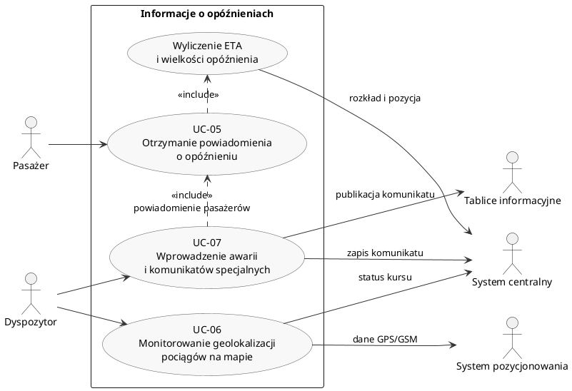
```plantuml
@startuml
left to right direction

skinparam packageStyle rectangle
skinparam usecase {
  BackgroundColor #F8F8F8
  BorderColor #555555
  ArrowColor #333333
}

actor "Pasażer" as Pasazer
actor "Dyspozytor" as Dyspozytor
actor "System pozycjonowania" as SystemPozycjonowania
actor "Tablice informacyjne" as TabliceInformacyjne
actor "System centralny" as SystemCentralny

rectangle "Informacje o opóźnieniach" {
  usecase "UC-05\nOtrzymanie powiadomienia\no opóźnieniu" as UC05
  usecase "UC-06\nMonitorowanie geolokalizacji\npociągów na mapie" as UC06
  usecase "UC-07\nWprowadzenie awarii\ni komunikatów specjalnych" as UC07
  usecase "Wyliczenie ETA\ni wielkości opóźnienia" as ETA
}

Pasazer --> UC05
Dyspozytor --> UC06
Dyspozytor --> UC07
UC05 .> ETA : <<include>>
UC06 --> SystemPozycjonowania : dane GPS/GSM
UC06 --> SystemCentralny : status kursu
UC07 .> UC05 : <<include>>\npowiadomienie pasażerów
UC07 --> TabliceInformacyjne : publikacja komunikatu
UC07 --> SystemCentralny : zapis komunikatu
ETA --> SystemCentralny : rozkład i pozycja
@enduml
```

#### UC-05: Otrzymanie powiadomienia o opóźnieniu

**Powiązana historia użytkownika:**  
Jako pasażer chcę otrzymywać powiadomienia o aktualnych opóźnieniach mojego pociągu w czasie rzeczywistym.

**Główny aktor:**  
Pasażer

**Warunki wstępne:**

- System wykrył opóźnienie pociągu przekraczające ustalony próg.
- Pasażer posiada aktywny bilet na dany kurs lub obserwuje daną podróż.
- Pasażer ma włączone powiadomienia dla tej podróży.

**Przepływ główny:**

1. System wykrywa opóźnienie pociągu przekraczające ustalony próg.
2. System identyfikuje pasażerów powiązanych z danym kursem.
3. System przygotowuje treść powiadomienia zawierającą numer pociągu, aktualną stację lub lokalizację, wielkość opóźnienia oraz przewidywany czas przyjazdu.
4. System wysyła powiadomienie push lub SMS do pasażera.
5. Pasażer odbiera powiadomienie.
6. Pasażer otwiera komunikat i zapoznaje się ze szczegółami opóźnienia.

**Przepływy alternatywne:**

**A1: Pasażer ma wyłączone powiadomienia**

1. System nie wysyła powiadomienia do pasażera.
2. Informacja o opóźnieniu pozostaje dostępna w szczegółach podróży.

**A2: Zmiana opóźnienia po wysłaniu komunikatu**

1. System ponownie wylicza opóźnienie i przewidywany czas przyjazdu.
2. Jeżeli zmiana jest istotna, system wysyła zaktualizowane powiadomienie do pasażera.

**Warunki końcowe:**

- **Sukces:** Pasażer zostaje poinformowany o opóźnieniu pociągu.
- **Błąd:** Powiadomienie nie zostaje wysłane, ale informacja pozostaje dostępna w szczegółach podróży.

---

#### UC-06: Monitorowanie geolokalizacji pociągów na mapie

**Powiązana historia użytkownika:**  
Jako dyspozytor chcę widzieć geolokalizację pociągów na mapie, aby monitorować ruch.

**Główny aktor:**  
Dyspozytor

**Warunki wstępne:**

- Dyspozytor ma dostęp do systemu RailTravel.
- System posiada aktualny rozkład jazdy.
- System odbiera dane lokalizacyjne z modułów GPS+GSM pojazdów.
- W systemie istnieją aktywne kursy pociągów.

**Przepływ główny:**

1. Dyspozytor otwiera moduł mapy geolokalizacyjnej.
2. System pobiera aktualne dane lokalizacyjne aktywnych pociągów.
3. System wyświetla pozycje pociągów na mapie.
4. System odświeża pozycje pociągów w czasie nie dłuższym niż 60 sekund.
5. Dyspozytor klika ikonę wybranego pociągu.
6. System wyświetla szczegóły pociągu: numer, trasę, opóźnienie i prędkość.
7. Dyspozytor analizuje status ruchu pociągów.

**Przepływy alternatywne:**

**A1: Utrata sygnału GPS**

1. System nie otrzymuje aktualnej lokalizacji pociągu.
2. System wyróżnia ikonę pociągu jako „sygnał utracony”.
3. System wyświetla ostatnią znaną lokalizację pociągu.

**A2: Brak danych lokalizacyjnych dla pociągu**

1. System nie posiada danych GPS dla wybranego pociągu.
2. System informuje dyspozytora o braku aktualnych danych.
3. Dyspozytor może odświeżyć widok lub sprawdzić inne dane operacyjne.

**Warunki końcowe:**

- **Sukces:** Dyspozytor widzi aktualne pozycje aktywnych pociągów na mapie.
- **Błąd:** System nie może wyświetlić aktualnych danych lokalizacyjnych i prezentuje ostatni znany status.

---

#### UC-07: Wprowadzenie awarii i komunikatów specjalnych

**Powiązana historia użytkownika:**  
Jako dyspozytor chcę wprowadzać awarie i komunikaty specjalne, aby informować pasażerów.

**Główny aktor:**  
Dyspozytor

**Warunki wstępne:**

- Dyspozytor jest zalogowany do systemu z odpowiednimi uprawnieniami.
- Dyspozytor zidentyfikował awarię, utrudnienie lub zmianę organizacyjną.
- System umożliwia przypisanie komunikatu do konkretnej linii lub stacji.

**Przepływ główny:**

1. Dyspozytor wybiera opcję wprowadzenia komunikatu specjalnego.
2. Dyspozytor przypisuje komunikat do konkretnej linii, stacji lub kursu.
3. Dyspozytor uzupełnia obowiązkowe pola: tytuł, treść oraz czas obowiązywania.
4. Dyspozytor zatwierdza publikację komunikatu.
5. System zapisuje komunikat w bazie danych.
6. System publikuje komunikat w aplikacji pasażerskiej w czasie poniżej 60 sekund.
7. System wysyła powiadomienia push lub SMS do pasażerów powiązanych z daną podróżą, jeżeli są dostępni.
8. System wyświetla komunikat na tablicach informacyjnych, jeżeli są zintegrowane z systemem.
9. Po upływie czasu obowiązywania system automatycznie archiwizuje komunikat.

**Przepływy alternatywne:**

**A1: Brak przypisanych pasażerów**

1. System nie znajduje pasażerów przypisanych do danej linii, stacji lub kursu.
2. System nie generuje wysyłki bezpośrednich powiadomień push lub SMS.
3. System publikuje komunikat w aplikacji oraz na ogólnodostępnych tablicach informacyjnych.

**A2: Brak wymaganych pól komunikatu**

1. Dyspozytor próbuje zapisać komunikat bez tytułu, treści lub czasu obowiązywania.
2. System blokuje zapis.
3. System wskazuje brakujące pola.
4. Dyspozytor uzupełnia dane i ponawia zapis.

**Warunki końcowe:**

- **Sukces:** Komunikat o awarii lub utrudnieniu zostaje zarejestrowany, opublikowany i widoczny dla pasażerów.
- **Błąd:** Komunikat nie zostaje opublikowany, a dyspozytor otrzymuje informację o przyczynie niepowodzenia.

---

### 1.2.4 Kontrola biletów

**Diagram przypadków użycia:**

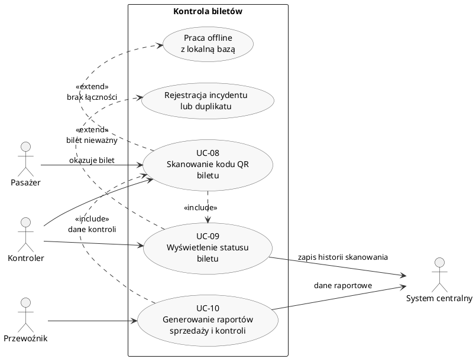
```plantuml
@startuml
left to right direction

skinparam packageStyle rectangle
skinparam usecase {
  BackgroundColor #F8F8F8
  BorderColor #555555
  ArrowColor #333333
}

actor "Kontroler" as Kontroler
actor "Pasażer" as Pasazer
actor "Przewoźnik" as Przewoznik
actor "System centralny" as SystemCentralny

rectangle "Kontrola biletów" {
  usecase "UC-08\nSkanowanie kodu QR\nbiletu" as UC08
  usecase "UC-09\nWyświetlenie statusu\nbiletu" as UC09
  usecase "UC-10\nGenerowanie raportów\nsprzedaży i kontroli" as UC10
  usecase "Rejestracja incydentu\nlub duplikatu" as Incydent
  usecase "Praca offline\nz lokalną bazą" as Offline
}

Kontroler --> UC08
Kontroler --> UC09
Pasazer --> UC08 : okazuje bilet
Przewoznik --> UC10
UC08 .> UC09 : <<include>>
UC08 .> Offline : <<extend>>\nbrak łączności
UC09 .> Incydent : <<extend>>\nbilet nieważny
UC09 --> SystemCentralny : zapis historii skanowania
UC10 .> UC08 : <<include>>\ndane kontroli
UC10 --> SystemCentralny : dane raportowe
@enduml
```

#### UC-08: Skanowanie kodu QR biletu

**Powiązana historia użytkownika:**  
Jako kontroler chcę zeskanować kod QR biletu w czasie poniżej 200 ms, aby przeprowadzać kontrolę szybciej.

**Główny aktor:**  
Kontroler

**Aktorzy wspierający:**  
Pasażer

**Warunki wstępne:**

- Kontroler rozpoczął kontrolę biletów w pociągu.
- Pasażer posiada bilet z kodem QR w formie elektronicznej lub papierowej.
- Urządzenie kontrolera ma uruchomioną aplikację kontrolerską.
- Aplikacja posiada dostęp do lokalnej kopii bazy biletów umożliwiającej pracę offline.
- Kod QR jest możliwy do okazania kontrolerowi.

**Przepływ główny:**

1. Kontroler podchodzi do pasażera i prosi o okazanie biletu.
2. Pasażer okazuje bilet z kodem QR.
3. Kontroler uruchamia funkcję skanowania biletu w aplikacji.
4. Kontroler kieruje skaner lub kamerę urządzenia na kod QR biletu.
5. System odczytuje kod QR.
6. System przetwarza dane zapisane w kodzie QR.
7. System weryfikuje dane biletu na podstawie lokalnej kopii bazy lub dostępnego połączenia z systemem centralnym.
8. System przekazuje wynik do przypadku użycia „UC-11: Wyświetlenie statusu biletu”.
9. Kontroler otrzymuje wynik skanowania w czasie nieprzekraczającym 200 ms od poprawnego odczytu kodu.

**Przepływy alternatywne:**

**A1: Kod QR jest nieczytelny**

1. System nie może odczytać kodu QR z biletu.
2. System wyświetla komunikat o błędzie odczytu w czasie krótszym niż 500 ms.
3. Kontroler prosi pasażera o ponowne okazanie biletu, zwiększenie jasności ekranu albo pokazanie innej wersji biletu.
4. Kontroler ponawia skanowanie.

**A2: Kod QR ma błędny format**

1. System odczytuje kod QR, ale nie rozpoznaje go jako poprawnego biletu.
2. System wyświetla komunikat o błędnym lub nieobsługiwanym kodzie.
3. Kontroler informuje pasażera o problemie.
4. Kontrola przechodzi do obsługi biletu jako nieważnego w ramach wyniku wyświetlanego w UC-11.

**A3: Brak połączenia z systemem centralnym**

1. System nie może połączyć się z systemem centralnym.
2. System przeprowadza weryfikację na podstawie lokalnej kopii bazy biletów.
3. System oznacza wynik jako uzyskany w trybie offline.
4. Historia skanowania zostaje zapisana lokalnie na urządzeniu kontrolera.

**A4: Warunki oświetleniowe są słabe**

1. Kontroler skanuje bilet przy oświetleniu poniżej 100 lx.
2. Aplikacja dostosowuje działanie skanera lub wykorzystuje doświetlenie urządzenia, jeżeli jest dostępne.
3. Jeżeli kod zostanie odczytany, proces przebiega dalej zgodnie z przepływem głównym.
4. Jeżeli kod nie zostanie odczytany, system przechodzi do alternatywy A1.

**Warunki końcowe:**

- **Sukces:** Kod QR zostaje odczytany, dane biletu zostają przetworzone, a system przechodzi do wyświetlenia statusu biletu.
- **Błąd:** Kod QR nie zostaje odczytany albo nie zawiera poprawnych danych biletu; system wyświetla komunikat o błędzie.

---

#### UC-09: Wyświetlenie statusu biletu

**Powiązana historia użytkownika:**  
Jako kontroler chcę widzieć status biletu: ważny, nieważny, duplikat lub zniżka, aby szybko informować pasażera.

**Główny aktor:**  
Kontroler

**Aktorzy wspierający:**  
Pasażer

**Warunki wstępne:**

- Kod QR biletu został zeskanowany lub przetworzony przez aplikację kontrolerską.
- System posiada dane potrzebne do określenia statusu biletu.
- Aplikacja kontrolerska działa online albo offline na podstawie lokalnej kopii bazy.
- Kontroler oczekuje na wynik kontroli biletu.

**Przepływ główny:**

1. System analizuje dane biletu pobrane z kodu QR.
2. System sprawdza status biletu w bazie lokalnej lub centralnej.
3. System określa jeden z podstawowych statusów biletu: WAŻNY, NIEWAŻNY, DUPLIKAT albo ZNIŻKA.
4. System wyświetla wynik na ekranie urządzenia kontrolera.
5. Kontroler odczytuje status biletu.
6. Kontroler informuje pasażera o wyniku kontroli.
7. System zapisuje skan w historii ostatnich skanowań na urządzeniu kontrolera.
8. Jeżeli bilet jest ważny i nie wymaga dodatkowych dokumentów, kontroler potwierdza ważność biletu i kończy kontrolę pasażera.
9. Pasażer kontynuuje podróż.

**Przepływy alternatywne:**

**A1: Status biletu — WAŻNY**

1. System wyświetla status WAŻNY.
2. Kontroler potwierdza ważność biletu.
3. System zapisuje pozytywny wynik kontroli w historii skanowań.
4. Pasażer kontynuuje podróż.

**A2: Status biletu — NIEWAŻNY**

1. System wyświetla status NIEWAŻNY.
2. Kontroler informuje pasażera, że bilet nie uprawnia do przejazdu.
3. Kontroler podejmuje dalsze działania zgodnie z procedurą przewoźnika, np. wystawia mandat.
4. System zapisuje negatywny wynik kontroli w historii skanowań.

**A3: Status biletu — DUPLIKAT**

1. System wyświetla status DUPLIKAT.
2. System rejestruje duplikat z datą, godziną oraz ID kontrolera.
3. Kontroler informuje pasażera o wykryciu biletu użytego ponownie albo podejrzanego o nadużycie.
4. Kontroler podejmuje dalsze działania zgodnie z procedurą przewoźnika.
5. System zapisuje zdarzenie w historii skanowań.

**A4: Status biletu — ZNIŻKA**

1. System wyświetla status ZNIŻKA.
2. System pokazuje typ zniżki oraz dokument wymagany do okazania.
3. Kontroler prosi pasażera o okazanie dokumentu potwierdzającego uprawnienie do zniżki.
4. Pasażer okazuje wymagany dokument.
5. Kontroler weryfikuje dokument.
6. Jeżeli dokument jest poprawny, kontroler potwierdza ważność biletu i oddaje dokument pasażerowi.
7. Jeżeli dokument jest niepoprawny albo pasażer go nie posiada, kontroler traktuje kontrolę jako negatywną i podejmuje dalsze działania zgodnie z procedurą przewoźnika.

**A5: Historia skanów działa offline**

1. System nie ma połączenia z systemem centralnym.
2. System zapisuje wynik kontroli lokalnie na urządzeniu kontrolera.
3. System udostępnia historię ostatnich 50 skanów offline.
4. Po odzyskaniu połączenia dane mogą zostać zsynchronizowane z systemem centralnym.

**Warunki końcowe:**

- **Sukces:** Kontroler otrzymuje jednoznaczny status biletu i może poinformować pasażera o wyniku kontroli.
- **Błąd:** Status biletu nie może zostać jednoznacznie ustalony; system zapisuje zdarzenie jako problematyczne albo wymaga ponownego skanowania.

---

#### UC-10: Generowanie raportów sprzedaży i kontroli biletów

**Powiązana historia użytkownika:**  
Jako przewoźnik chcę generować raporty sprzedaży i kontroli biletów, aby analizować obciążenie ruchu.

**Główny aktor:**  
Przewoźnik

**Warunki wstępne:**

- Przewoźnik jest zalogowany do systemu z odpowiednimi uprawnieniami.
- System posiada dane sprzedażowe oraz dane z kontroli biletów.
- Dane kontroli obejmują co najmniej liczbę skanowań oraz informacje o biletach nieważnych i duplikatach.
- Dane sprzedażowe obejmują co najmniej liczbę biletów, przychód, klasy i trasy.
- Zakres raportu może zostać określony przez użytkownika.

**Przepływ główny:**

1. Przewoźnik otwiera moduł raportów w systemie.
2. System wyświetla formularz konfiguracji raportu.
3. Przewoźnik wybiera zakres dat raportu.
4. Przewoźnik wybiera granulację danych: dzień, tydzień albo miesiąc.
5. Przewoźnik wybiera zakres raportu: sprzedaż, kontrola biletów albo raport łączony.
6. System pobiera dane sprzedażowe dla wskazanego okresu.
7. System pobiera dane kontroli biletów dla wskazanego okresu.
8. System agreguje liczbę biletów, przychód, podział na klasy i trasy.
9. System agreguje liczbę skanowań, odsetek biletów nieważnych oraz odsetek duplikatów.
10. System generuje raport.
11. System wyświetla podgląd raportu przewoźnikowi.
12. Przewoźnik pobiera raport w formacie CSV albo PDF.
13. System zapisuje informację o wygenerowaniu raportu.

**Przepływy alternatywne:**

**A1: Brak danych dla wskazanego okresu**

1. Przewoźnik wybiera zakres dat, dla którego system nie posiada danych.
2. System wyświetla komunikat o braku danych.
3. Przewoźnik może zmienić zakres dat albo anulować generowanie raportu.

**A2: Zbyt duży zakres danych**

1. Przewoźnik wybiera bardzo szeroki zakres dat.
2. System informuje, że wygenerowanie raportu może potrwać dłużej albo wymaga zawężenia zakresu.
3. Przewoźnik zmienia zakres dat lub wybiera większą granulację danych.

**A3: Błąd generowania pliku PDF lub CSV**

1. System poprawnie agreguje dane, ale nie może wygenerować wybranego formatu pliku.
2. System wyświetla komunikat o błędzie eksportu.
3. Przewoźnik może ponowić eksport albo wybrać drugi dostępny format.

**A4: Raport za okres 30 dni przekracza limit czasu**

1. System rozpoczyna generowanie raportu za okres 30 dni.
2. Generowanie przekracza wymagany limit 10 sekund.
3. System informuje o problemie wydajnościowym lub proponuje wygenerowanie raportu w tle, zależnie od konfiguracji systemu.
4. Zdarzenie zostaje zapisane jako błąd operacyjny.

**Warunki końcowe:**

- **Sukces:** Raport sprzedaży i/lub kontroli biletów zostaje wygenerowany dla wskazanego zakresu dat i może zostać pobrany w formacie CSV lub PDF.
- **Błąd:** Raport nie zostaje wygenerowany albo nie może zostać pobrany; system informuje przewoźnika o przyczynie problemu.

## Diagram przypadków użycia (Use Case Diagram)

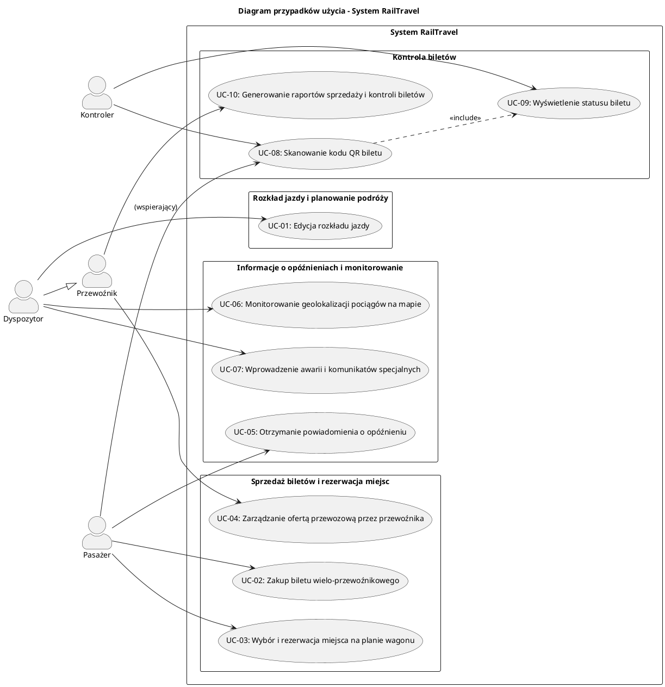
```plantuml
@startuml
skinparam packageStyle rectangle
skinparam actorStyle awesome
left to right direction

title Diagram przypadków użycia - System RailTravel

actor "Przewoźnik" as Carrier
actor "Dyspozytor" as Dispatcher
actor "Pasażer" as Passenger
actor "Kontroler" as Controller

Dispatcher --|> Carrier

rectangle "System RailTravel" {
    package "Rozkład jazdy i planowanie podróży" {
        usecase "UC-01: Edycja rozkładu jazdy" as UC01
    }

    package "Sprzedaż biletów i rezerwacja miejsc" {
        usecase "UC-02: Zakup biletu wielo-przewoźnikowego" as UC02
        usecase "UC-03: Wybór i rezerwacja miejsca na planie wagonu" as UC03
        usecase "UC-04: Zarządzanie ofertą przewozową przez przewoźnika" as UC04
    }

    package "Informacje o opóźnieniach i monitorowanie" {
        usecase "UC-05: Otrzymanie powiadomienia o opóźnieniu" as UC05
        usecase "UC-06: Monitorowanie geolokalizacji pociągów na mapie" as UC06
        usecase "UC-07: Wprowadzenie awarii i komunikatów specjalnych" as UC07
    }

    package "Kontrola biletów" {
        usecase "UC-08: Skanowanie kodu QR biletu" as UC08
        usecase "UC-09: Wyświetlenie statusu biletu" as UC09
        usecase "UC-10: Generowanie raportów sprzedaży i kontroli biletów" as UC10
    }
    
    UC08 ..> UC09 : <<include>>
}

Carrier --> UC04
Carrier --> UC10
Dispatcher --> UC01
Dispatcher --> UC06
Dispatcher --> UC07
Passenger --> UC02
Passenger --> UC03
Passenger --> UC05
Passenger --> UC08 : "(wspierający)"
Controller --> UC08
Controller --> UC09
@endum```
---
# 2. Opis systemu
## 2.1. WBS
1. **Zarządzanie Projektem**
    1.1. **Inicjacja projektu**
        1.1.1. Opracowanie PMP (Project Management Plan) i rejestru ryzyk
        1.1.2. Organizacja spotkania Kick-off i powołanie komitetu sterującego
    1.2. **Cykl wytwórczy (Agile/DevOps)**
        1.2.1. Konfiguracja środowiska pracy (Jira / Confluence)
        1.2.2. Prowadzenie ceremonii Agile (Planowanie sprintów, Daily Stand-ups)

2. **Analiza i Projektowanie**
    2.1. **Analiza wymagań i procesów**
        2.1.1. Warsztaty techniczne API z przewoźnikami
        2.1.2. Opracowanie specyfikacji technicznej kodów QR (wymóg skanowania < 200ms)
    2.2. **Architektura IT**
        2.2.1. Projekt systemu mikroserwisów (skalowalność powyżej 10 mln transakcji)
        2.2.2. Projekt architektury bazy danych o wysokiej dostępności (HA)
    2.3. **UX/UI Design**
        2.3.1. Przygotowanie makiet aplikacji dla pasażera
        2.3.2. Projekt interfejsu terminala (wysoki kontrast, obsługa norm IP67)

3. **Implementacja Modułów**
    3.1. **System Sprzedaży i Rezerwacji**
        3.1.1. Silnik wyszukiwarki połączeń (czas odpowiedzi < 2s)
        3.1.2. Integracja z bramką płatności (zgodność z SCA)
        3.1.3. Mechanizm generowania biletów zbiorczych
    3.2. **System IoT i Śledzenie Floty**
        3.2.1. Implementacja odbiornika danych MQTT (częstotliwość GPS co 60s)
        3.2.2. Opracowanie algorytmu estymacji czasu przyjazdu (ETA)
        3.2.3. System powiadomień Push dla pasażerów
    3.3. **Kontrola i Raportowanie**
        3.3.1. Oprogramowanie skanera QR z trybem pracy Offline
        3.3.2. Budowa panelu Business Intelligence (BI) dla przewoźnika
    3.4. **Infrastruktura i Bezpieczeństwo**
        3.4.1. Konteneryzacja usług (Kubernetes - K8s)
        3.4.2. Wdrożenie standardów Cybersec (TLS 1.2+, zgodność z RODO)

4. **Testowanie i Jakość**
    4.1. **Testy Techniczne**
        4.1.1. Testy obciążeniowe (Load Tests dla 50 tys. pojazdów/pociągów)
        4.1.2. Audyt bezpieczeństwa i testy penetracyjne
    4.2. **Testy UAT i Operacyjne**
        4.2.1. Testy polowe skanowania (weryfikacja w tunelach/braku zasięgu)
        4.2.2. Odbiory końcowe (UAT) przez Przewoźników

5. **Wdrożenie i Szkolenia**
    5.1. **Warstwa sprzętowa (Hardware)**
        5.1.1. Konfiguracja i setup terminali mobilnych (klasa IP67)
        5.1.2. Fizyczny montaż nadajników GPS w pojazdach
    5.2. **Produkcyjne uruchomienie**
        5.2.1. Migracja danych z systemów legacy
        5.2.2. Procedura Go-Live i okres wsparcia powdrożeniowego (Hypercare)
    5.3. **Szkolenia i edukacja**
        5.3.1. Przeszkolenie personelu pokładowego i konduktorów
        5.3.2. Warsztaty dla administratorów systemu po stronie klienta

6. **Wsparcie i Utrzymanie**
    6.1. **Utrzymanie systemowe**
        6.1.1. Monitoring wydajności infrastruktury (SRE)
        6.1.2. Zarządzanie aktualizacjami i poprawkami (Patch Management)
    6.2. **Service Desk**
        6.2.1. Obsługa zgłoszeń L1/L2/L3 (SLA 24/7/365)
        6.2.2. Zarządzanie bazą wiedzy dla użytkowników końcowych


```mermaid
graph LR
    %% --- Definicje Stylów (Klasy) ---
    classDef root fill:#2d5a88,color:#000,stroke-width:3px,stroke:#1a3f63,rx:10,ry:10;
    classDef p1 fill:#e1f5fe,stroke:#01579b,stroke-width:2px,rx:5,ry:5;
    classDef p2 fill:#fff3e0,stroke:#e65100,stroke-width:2px,rx:5,ry:5;
    classDef p3 fill:#e8f5e9,stroke:#2e7d32,stroke-width:2px,rx:5,ry:5;
    classDef leaf fill:#fff,stroke:#757575,stroke-width:1px,rx:2,ry:2;

    %% --- GŁÓWNY KORZEŃ PROJEKTU ---
    WBS["PROJEKT: SYSTEM TRANZYTOWY"]:::root

    %% ==========================================
    %% === SEKCJA 1 & 2: ZARZĄDZANIE I ANALIZA ===
    %% ==========================================
    WBS --> P1_MGT["1. Zarządzanie Projektem"]:::p1
    WBS --> P2_ANA["2. Analiza i Projektowanie"]:::p1

    %% --- 1. ZARZĄDZANIE ---
    P1_MGT --> P11["1.1 Inicjacja"]:::p1
    P11 --> P111["Opracowanie PMP i rejestru ryzyk"]:::leaf
    P11 --> P112["Kick-off i powołanie komitetu"]:::leaf
    
    P1_MGT --> P12["1.2 Cykl wytwórczy"]:::p1
    P12 --> P121["Setup Jira/Confluence"]:::leaf
    P12 --> P122["Ceremonie Agile (Sprinty/Daily)"]:::leaf

    %% --- 2. ANALIZA ---
    P2_ANA --> P21["2.1 Analiza wymagań"]:::p1
    P21 --> P211["Warsztaty API z przewoźnikami"]:::leaf
    P21 --> P212["Specyfikacja QR (skan < 200ms)"]:::leaf
    
    P2_ANA --> P22["2.2 Architektura IT"]:::p1
    P22 --> P221["Projekt mikroserwisów (10mln+)"]:::leaf
    P22 --> P222["Architektura bazy danych HA"]:::leaf
    
    P2_ANA --> P23["2.3 UX/UI"]:::p1
    P23 --> P231["Makiety aplikacji pasażera"]:::leaf
    P23 --> P232["UI terminala (kontrast/IP67)"]:::leaf

    %% ==========================================
    %% === SEKCJA 3: IMPLEMENTACJA MODUŁÓW ======
    %% ==========================================
    WBS --> P3_IMP["3. Implementacja Modułów"]:::p2

    %% --- 3. IMPLEMENTACJA ---
    P3_IMP --> P31["3.1 Sprzedaż i Rezerwacja"]:::p2
    P3_IMP --> P32["3.2 IoT i Śledzenie"]:::p2
    P3_IMP --> P33["3.3 Kontrola i Raporty"]:::p2
    P3_IMP --> P34["3.4 Infrastruktura i Sec"]:::p2

    %% --- Detale 3 ---
    P31 --> P311["Wyszukiwarka połączeń (< 2s)"]:::leaf
    P31 --> P312["Bramka płatności (SCA)"]:::leaf
    P31 --> P313["Generowanie biletów zbiorczych"]:::leaf

    P32 --> P321["Odbiornik MQTT (GPS co 60s)"]:::leaf
    P32 --> P322["Algorytm estymacji ETA"]:::leaf
    P32 --> P323["System powiadomień Push"]:::leaf

    P33 --> P331["Skaner QR (Tryb Offline)"]:::leaf
    P33 --> P332["Panel BI dla przewoźnika"]:::leaf

    P34 --> P341["Konteneryzacja (K8s)"]:::leaf
    P34 --> P342["Cybersec (TLS 1.2+ / RODO)"]:::leaf

    %% ==========================================
    %% === SEKCJA 4 & 5: TESTY I WDROŻENIE ======
    %% ==========================================
    WBS --> P4_TST["4. Testowanie i Jakość"]:::p3
    WBS --> P5_DEP["5. Wdrożenie i Szkolenia"]:::p3
    WBS --> P6_SUP["6. Wsparcie i Utrzymanie"]:::p3

    %% --- 4. TESTY ---
    P4_TST --> P41["4.1 Testy Techniczne"]:::p3
    P41 --> P411["Load Testy (50k pociągów)"]:::leaf
    P41 --> P412["Audyt bezpieczeństwa"]:::leaf
    
    P4_TST --> P42["4.2 UAT i Polowe"]:::p3
    P42 --> P421["Testy skanowania w tunelach"]:::leaf
    P42 --> P422["Akceptacja Przewoźników"]:::leaf

    %% --- 5. WDROŻENIE ---
    P5_DEP --> P51["5.1 Hardware"]:::p3
    P51 --> P511["Setup terminali (IP67)"]:::leaf
    P51 --> P512["Montaż nadajników GPS"]:::leaf
    
    P5_DEP --> P52["5.2 Produkcja"]:::p3
    P52 --> P521["Migracja danych legacy"]:::leaf
    P52 --> P522["Go-Live i Hypercare"]:::leaf
    
    P5_DEP --> P53["5.3 Szkolenia"]:::p3
    P53 --> P531["Szkolenia konduktorów"]:::leaf
    P53 --> P532["Szkolenia administratorów"]:::leaf

    %% --- 6. WSPARCIE I UTRZYMANIE ---
    P6_SUP --> P61["6.1 Utrzymanie systemowe"]:::p3
    P61 --> P611["Monitoring wydajności (SRE)"]:::leaf
    P61 --> P612["Patch Management"]:::leaf

    P6_SUP --> P62["6.2 Service Desk"]:::p3
    P62 --> P621["Obsługa L1/L2/L3 (SLA 24/7/365)"]:::leaf
    P62 --> P622["Zarządzanie bazą wiedzy"]:::leaf
```
## 2.2. Architektura C4

Diagramy C4 przedstawiają architekturę systemu na trzech poziomach szczegółowości: kontekstu systemowego, kontenerów oraz komponentów modułu rezerwacji.

### 2.2.1. C4 Level 1 - System Context

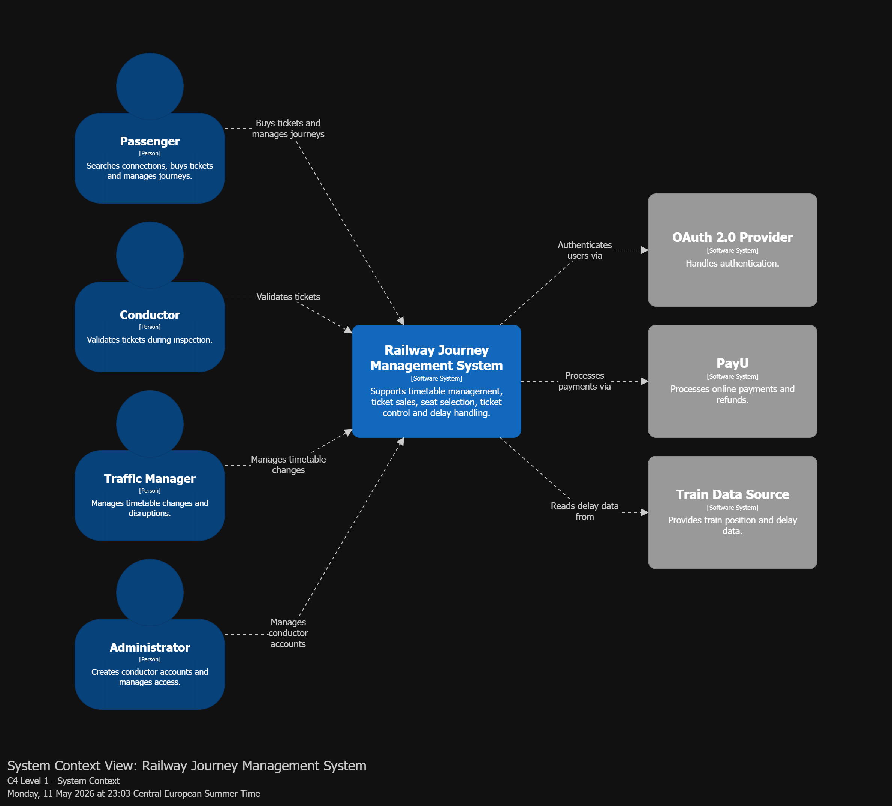

### 2.2.2. C4 Level 2 - Container Diagram

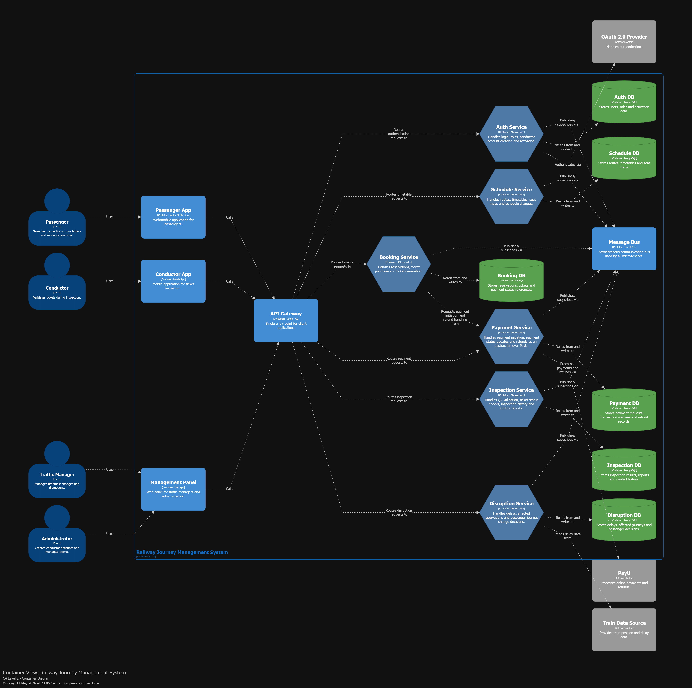

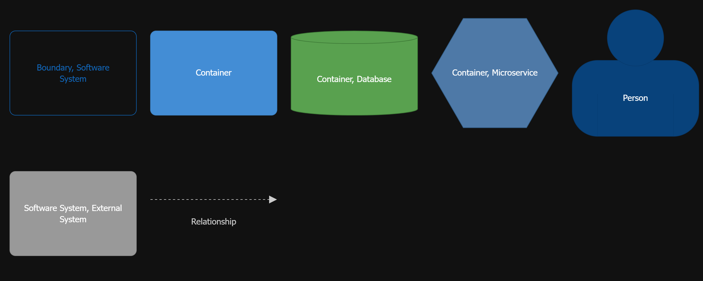

### 2.2.3. C4 Level 3 - Booking Service Components

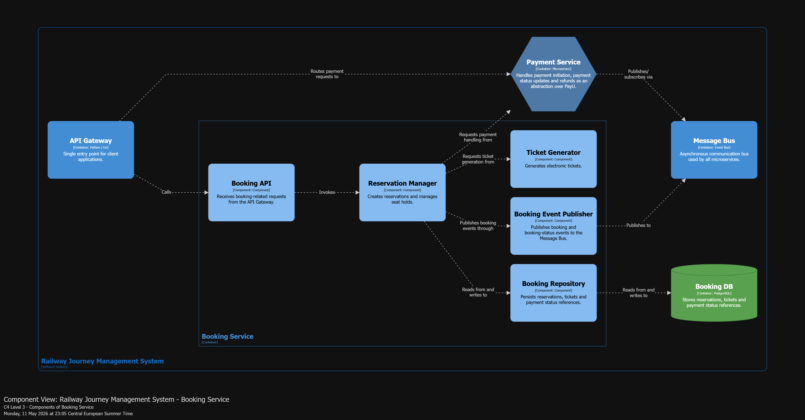

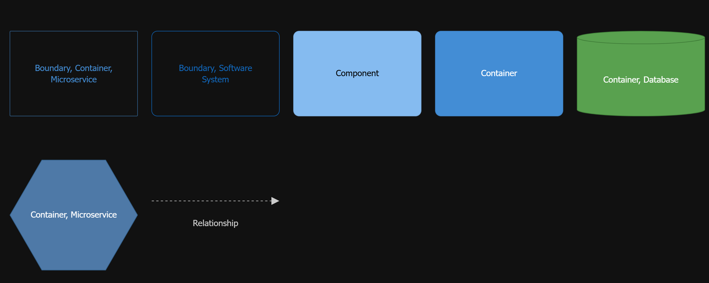

## 2.3. User story mapping

Rezultat warsztatów user story mapping został zapisany jako osobne wizualizacje HTML dla każdego procesu. Każda mapa zachowuje podział na:

* **Aktywności** - główne etapy procesu użytkownika.
* **Zadania użytkownika** - kroki wykonywane w ramach aktywności.
* **User stories** - zakres funkcjonalny podzielony na MVP oraz kolejną iterację.

### 2.3.1. Sprzedaż biletów

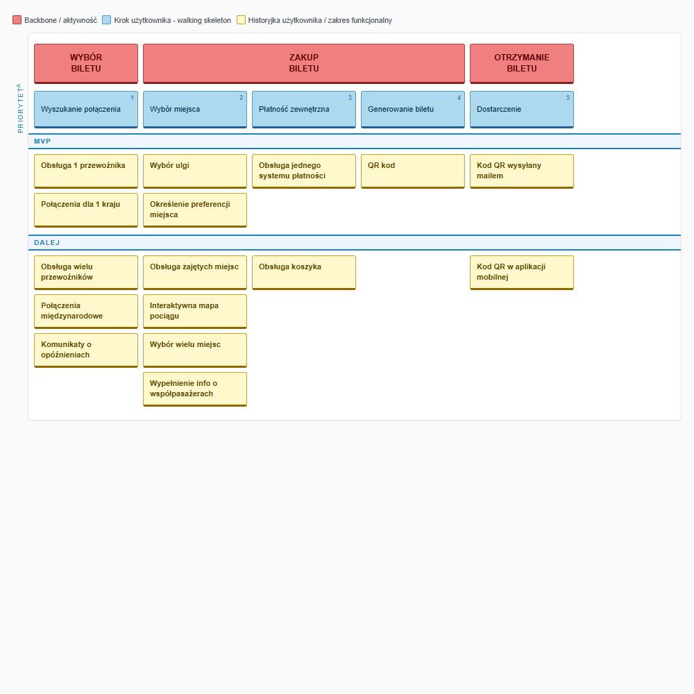

**Tekst z wizualizacji:**

* **Aktywności:** Wybór biletu; Zakup biletu; Otrzymanie biletu.
* **Kroki użytkownika:** 1. Wyszukanie połączenia; 2. Wybór miejsca; 3. Płatność zewnętrzna; 4. Generowanie biletu; 5. Dostarczenie.
* **MVP:** Obsługa 1 przewoźnika; Połączenia dla 1 kraju; Wybór ulgi; Określenie preferencji miejsca; Obsługa jednego systemu płatności; QR kod; Kod QR wysyłany mailem.
* **Dalej:** Obsługa wielu przewoźników; Połączenia międzynarodowe; Komunikaty o opóźnieniach; Obsługa zajętych miejsc; Interaktywna mapa pociągu; Wybór wielu miejsc; Wypełnienie info o współpasażerach; Obsługa koszyka; Kod QR w aplikacji mobilnej.

### 2.3.2. Śledzenie opóźnień

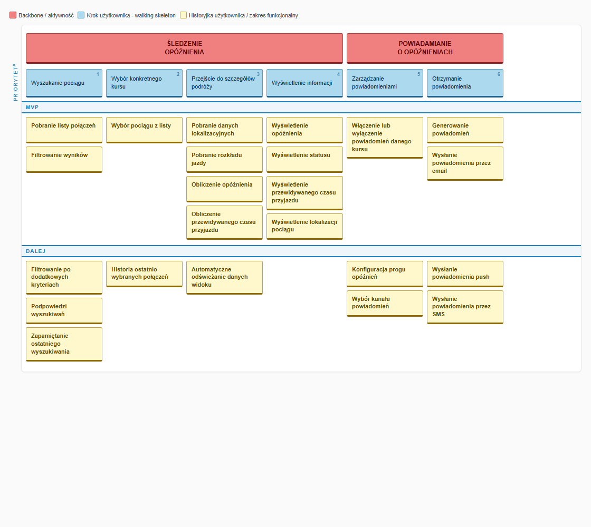

**Tekst z wizualizacji:**

* **Aktywności:** Śledzenie opóźnienia; Powiadamianie o opóźnieniach.
* **Kroki użytkownika:** 1. Wyszukanie pociągu; 2. Wybór konkretnego kursu; 3. Przejście do szczegółów podróży; 4. Wyświetlenie informacji; 5. Zarządzanie powiadomieniami; 6. Otrzymanie powiadomienia.
* **MVP:** Pobranie listy połączeń; Filtrowanie wyników; Wybór pociągu z listy; Pobranie danych lokalizacyjnych; Pobranie rozkładu jazdy; Obliczenie opóźnienia; Obliczenie przewidywanego czasu przyjazdu; Wyświetlenie opóźnienia; Wyświetlenie statusu; Wyświetlenie przewidywanego czasu przyjazdu; Wyświetlenie lokalizacji pociągu; Włączenie lub wyłączenie powiadomień danego kursu; Generowanie powiadomień; Wysłanie powiadomienia przez email.
* **Dalej:** Filtrowanie po dodatkowych kryteriach; Podpowiedzi wyszukiwań; Zapamiętanie ostatniego wyszukiwania; Historia ostatnio wybranych połączeń; Automatyczne odświeżanie danych widoku; Konfiguracja progu opóźnień; Wybór kanału powiadomień; Wysłanie powiadomienia push; Wysłanie powiadomienia przez SMS.

### 2.3.3. Kontrola biletów

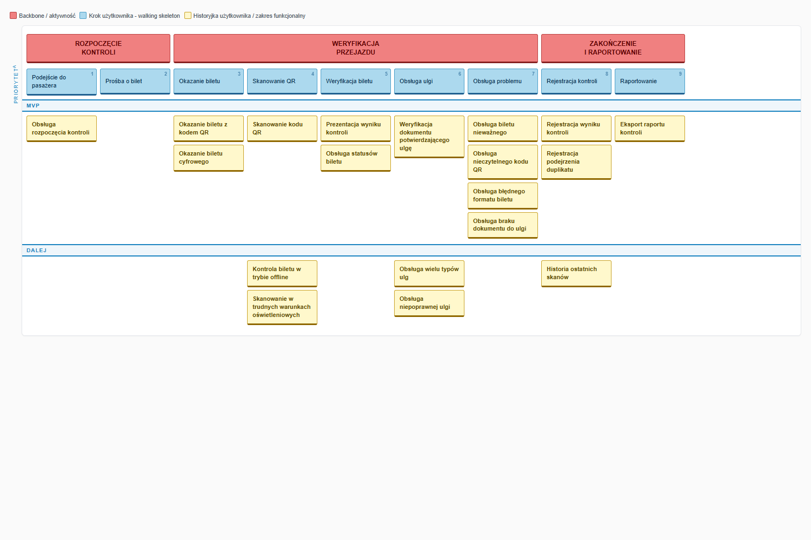

**Tekst z wizualizacji:**

* **Aktywności:** Rozpoczęcie kontroli; Weryfikacja przejazdu; Zakończenie i raportowanie.
* **Kroki użytkownika:** 1. Podejście do pasażera; 2. Prośba o bilet; 3. Okazanie biletu; 4. Skanowanie QR; 5. Weryfikacja biletu; 6. Obsługa ulgi; 7. Obsługa problemu; 8. Rejestracja kontroli; 9. Raportowanie.
* **MVP:** Obsługa rozpoczęcia kontroli; Okazanie biletu z kodem QR; Okazanie biletu cyfrowego; Skanowanie kodu QR; Prezentacja wyniku kontroli; Obsługa statusów biletu; Weryfikacja dokumentu potwierdzającego ulgę; Obsługa biletu nieważnego; Obsługa nieczytelnego kodu QR; Obsługa błędnego formatu biletu; Obsługa braku dokumentu do ulgi; Rejestracja wyniku kontroli; Rejestracja podejrzenia duplikatu; Eksport raportu kontroli.
* **Dalej:** Kontrola biletu w trybie offline; Skanowanie w trudnych warunkach oświetleniowych; Obsługa wielu typów ulg; Obsługa niepoprawnej ulgi; Historia ostatnich skanów.

## 2.4. Harmonogram prac
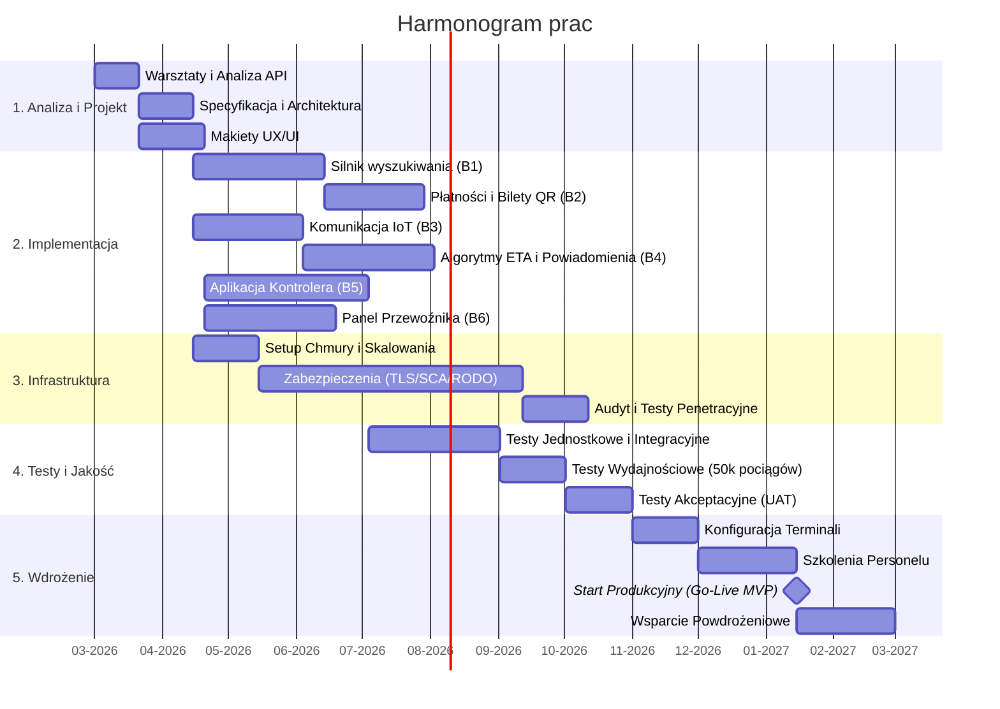
```mermaid
gantt
    title Harmonogram prac
    dateFormat  YYYY-MM-DD
    axisFormat  %m-%Y
    tickInterval 1month

    section 1. Analiza i Projekt
    Warsztaty i Analiza API              :a1, 2026-03-01, 20d
    Specyfikacja i Architektura          :a2, after a1, 25d
    Makiety UX/UI                        :a3, after a1, 30d

    section 2. Implementacja
    Silnik wyszukiwania (B1)             :b1, after a2, 60d
    Płatności i Bilety QR (B2)           :b2, after b1, 45d
    Komunikacja IoT (B3)                 :b3, after a2, 50d
    Algorytmy ETA i Powiadomienia (B4)   :b4, after b3, 60d
    Aplikacja Kontrolera (B5)            :b5, after a3, 75d
    Panel Przewoźnika (B6)               :b6, after a3, 60d

    section 3. Infrastruktura
    Setup Chmury i Skalowania            :c1, after a2, 30d
    Zabezpieczenia (TLS/SCA/RODO)        :c2, after c1, 120d
    Audyt i Testy Penetracyjne           :c3, after c2, 30d

    section 4. Testy i Jakość
    Testy Jednostkowe i Integracyjne     :d1, after b1 b3 b5, 60d
    Testy Wydajnościowe (50k pociągów)   :d2, after d1, 30d
    Testy Akceptacyjne (UAT)             :d3, after d2, 30d

    section 5. Wdrożenie
    Konfiguracja Terminali               :e1, after d3, 30d
    Szkolenia Personelu                  :e2, after e1, 45d
    Start Produkcyjny (Go-Live MVP)      :milestone, m1, after e2, 0d
    Wsparcie Powdrożeniowe               :e3, after m1, 45d
```
## 2.5. Kosztorys projektu i harmonogram płatności

### 2.5.1. Szczegółowe zestawienie kosztów prac rozwojowych

| Zadanie / Etap | Liczba osobodni | Stawka dzienna (PLN) | Koszt netto (PLN) |
| :--- | :---: | :---: | :---: |
| **1. Zarządzanie Projektem** | **190** | | **380 000** |
| &nbsp;&nbsp;&nbsp;&nbsp;1.1. Inicjacja projektu | 30 | 2 000 | 60 000 |
| &nbsp;&nbsp;&nbsp;&nbsp;1.2. Cykl wytwórczy (Agile/DevOps) | 160 | 2 000 | 320 000 |
| **2. Analiza i Projektowanie** | **155** | | **302 000** |
| &nbsp;&nbsp;&nbsp;&nbsp;2.1. Analiza wymagań i procesów | 60 | 1 800 | 108 000 |
| &nbsp;&nbsp;&nbsp;&nbsp;2.2. Architektura IT | 45 | 2 200 | 99 000 |
| &nbsp;&nbsp;&nbsp;&nbsp;2.3. UX/UI Design | 50 | 1 900 | 95 000 |
| **3. Implementacja Modułów** | **570** | | **1 164 000** |
| &nbsp;&nbsp;&nbsp;&nbsp;3.1. System Sprzedaży i Rezerwacji | 160 | 2 000 | 320 000 |
| &nbsp;&nbsp;&nbsp;&nbsp;3.2. System IoT i Śledzenie Floty | 140 | 2 000 | 280 000 |
| &nbsp;&nbsp;&nbsp;&nbsp;3.3. Kontrola i Raportowanie | 150 | 2 000 | 300 000 |
| &nbsp;&nbsp;&nbsp;&nbsp;3.4. Infrastruktura i Bezpieczeństwo | 120 | 2 200 | 264 000 |
| **4. Testowanie i Jakość** | **125** | | **222 500** |
| &nbsp;&nbsp;&nbsp;&nbsp;4.1. Testy integracyjne | 35 | 1 700 | 59 500 |
| &nbsp;&nbsp;&nbsp;&nbsp;4.2. Testy wydajnościowe i obciążeniowe | 25 | 1 800 | 45 000 |
| &nbsp;&nbsp;&nbsp;&nbsp;4.3. Audyt i testy bezpieczeństwa | 20 | 2 200 | 44 000 |
| &nbsp;&nbsp;&nbsp;&nbsp;4.4. Testy polowe i operacyjne sprzętu | 25 | 1 600 | 40 000 |
| &nbsp;&nbsp;&nbsp;&nbsp;4.5. Testy UAT (User Acceptance Testing) | 20 | 1 700 | 34 000 |
| **5. Wdrożenie i Szkolenia** | **160** | | **294 000** |
| &nbsp;&nbsp;&nbsp;&nbsp;5.1. Dobór, konfiguracja i montaż sprzętu | 40 | 1 800 | 72 000 |
| &nbsp;&nbsp;&nbsp;&nbsp;5.2. Migracja danych i konfiguracja prod. | 30 | 2 000 | 60 000 |
| &nbsp;&nbsp;&nbsp;&nbsp;5.3. Procedura Go-Live MVP i Hypercare | 40 | 2 000 | 80 000 |
| &nbsp;&nbsp;&nbsp;&nbsp;5.4. Szkolenia personelu terenowego | 30 | 1 600 | 48 000 |
| &nbsp;&nbsp;&nbsp;&nbsp;5.5. Szkolenia administracji i dyspozytorów | 20 | 1 700 | 34 000 |
| **6. Wsparcie i Utrzymanie (24 m-ce)** | **220** | **1 600** | **352 000** |

### 2.5.2. Koszty materiałów, sprzętu i koszty pośrednie

| Kategoria | Pozycja / Szczegóły | Koszt netto (PLN) |
| :--- | :--- | :---: |
| **Sprzęt i Materiały** | | **350 000** |
| | Terminale mobilne IP67 (100 szt.) | 150 000 |
| | Nadajniki GPS i akcesoria (50 szt.) | 50 000 |
| | Licencje, SSL i infrastruktura HA | 150 000 |
| **Koszty pośrednie** | | **135 000** |
| | Koszty administracyjne, biurowe, komunikacji | 135 000 |

### 2.5.3. Podsumowanie finansowe (Wersja Pełna)

| Kategoria | Kwota (PLN) |
| :--- | :---: |
| Suma kosztów bezpośrednich i pośrednich | 3 199 500 |
| Bufor na nieprzewidziane wydatki (10%) | 319 950 |
| **Wartość netto całkowita** | **3 519 450** |
| VAT (23%) | 809 473,50 |
| **Wartość brutto całkowita** | **4 328 923,50** |

### 2.5.4. Kosztorys wersji MVP (Minimum Viable Product)

| Kategoria MVP | Koszt netto (PLN) |
| :--- | :---: |
| Zarządzanie Projektem (60% zakresu) | 228 000 |
| Analiza i Projektowanie (80% zakresu) | 241 600 |
| Implementacja podstawowych modułów (45% zakresu) | 523 800 |
| Testowanie podstawowych modułów (50% zakresu) | 111 250 |
| Wdrożenie i podstawowe szkolenia (40% zakresu) | 117 600 |
| Sprzęt (50 terminali) + Licencje/Chmura | 195 000 |
| Koszty pośrednie (60% zakresu) | 81 000 |
| **Suma netto MVP (z 10% buforem)** | **1 648 075** |
| **Wartość brutto MVP** | **2 027 132,25** |

### 2.5.5. Harmonogram płatności

| Etap projektu | % Płatności | Kwota netto (PLN) | Przewidywany termin |
| :--- | :---: | :---: | :---: |
| Podpisanie umowy (Zaliczka) | 20% | 703 890,00 | 30.04.2026 |
| Zakończenie analizy i projektowania | 15% | 527 917,50 | 15.06.2026 |
| Zakończenie implementacji modułów | 25% | 879 862,50 | 15.09.2026 |
| Zakończenie infrastruktury i testów | 15% | 527 917,50 | 15.11.2026 |
| Odbiór końcowy i wdrożenie | 15% | 527 917,50 | 15.01.2027 |
| Zakończenie okresu gwarancyjnego | 10% | 351 945,00 | 15.01.2029 |

### 2.5.6. Dodatkowe uwagi i założenia

* Kosztorys zakłada standardową stawkę godzinową specjalistów IT zgodnie z aktualnymi stawkami rynkowymi.
* Rozbudowana faza testów operacyjnych i terenowych ma kluczowe znaczenie dla weryfikacji niezawodności pracy w warunkach braku dostępu do sieci, co odpowiada specyfice transportu kolejowego.
* Urządzenia do skanowania kodów QR spełniają wymagania postawione w specyfikacji (norma IP67, weryfikacja w trudnych warunkach oświetleniowych, czas odczytu < 200 ms).
* Wsparcie i utrzymanie obejmuje 24 miesiące po zakończeniu wdrożenia (Hypercare i bieżące poprawki).
* Bufor na nieprzewidziane wydatki (10%) uwzględnia potencjalne ryzyka związane z m.in. zmianami w procesach u przewoźników, opóźnieniami integracji API oraz problemami z fizycznym montażem nadajników GPS w taborach o różnej konstrukcji.
## 2.6 UI Mockupy
Panel Administratora do zarządzania dostępem 
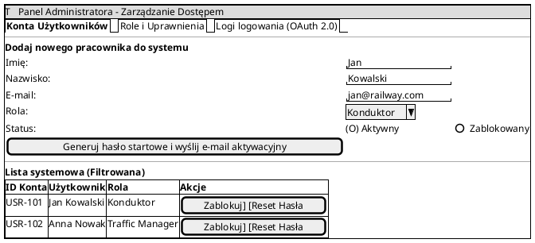
```plantuml
@startsalt
{+
  {* T | Panel Administratora - Zarządzanie Dostępem }
  {/ <b>Konta Użytkowników</b> | Role i Uprawnienia | Logi logowania (OAuth 2.0) }
  ---
  <b>Dodaj nowego pracownika do systemu</b>
  {
    Imię: | "Jan             "
    Nazwisko: | "Kowalski        "
    E-mail: | "jan@railway.com "
    Rola: | ^Konduktor^
    Status: | (O) Aktywny | ( ) Zablokowany
    [ Generuj hasło startowe i wyślij e-mail aktywacyjny ]
  }
  ---
  <b>Lista systemowa (Filtrowana)</b>
  {#
    <b>ID Konta</b> | <b>Użytkownik</b> | <b>Rola</b> | <b>Akcje</b>
    USR-101 | Jan Kowalski | Konduktor | [Zablokuj] [Reset Hasła]
    USR-102 | Anna Nowak | Traffic Manager | [Zablokuj] [Reset Hasła]
  }
}
@endsalt
```

Panel zarządzania administratora
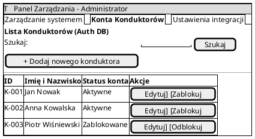
```plantuml
@startsalt
{+
  {* T | Panel Zarządzania - Administrator }
  {/ Zarządzanie systemem | <b>Konta Konduktorów</b> | Ustawienia integracji }
  {
    <b>Lista Konduktorów (Auth DB)</b>
    Szukaj: | "          " | [ Szukaj ]
    [ + Dodaj nowego konduktora ]
  }
  ---
  {#
    <b>ID</b> | <b>Imię i Nazwisko</b> | <b>Status konta</b> | <b>Akcje</b>
    K-001 | Jan Nowak | Aktywne | [Edytuj] [Zablokuj]
    K-002 | Anna Kowalska | Aktywne | [Edytuj] [Zablokuj]
    K-003 | Piotr Wiśniewski | Zablokowane | [Edytuj] [Odblokuj]
  }
}
@endsalt
```

Panel pasażera - wyszukiwanie połączeń
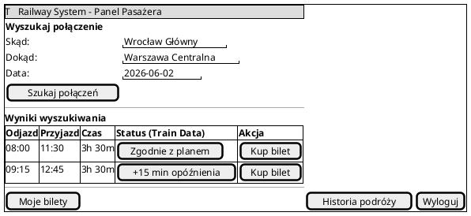
```plantuml
@startsalt
{+
  {* T | Railway System - Panel Pasażera }
  {
    <b>Wyszukaj połączenie</b>
    Skąd: | "Wrocław Główny  "
    Dokąd: | "Warszawa Centralna"
    Data: | "2026-06-02  "
    [ Szukaj połączeń ]
  }
  ---
  <b>Wyniki wyszukiwania</b>
  {#
    <b>Odjazd</b> | <b>Przyjazd</b> | <b>Czas</b> | <b>Status (Train Data)</b> | <b>Akcja</b>
    08:00 | 11:30 | 3h 30m | [Zgodnie z planem] | [Kup bilet]
    09:15 | 12:45 | 3h 30m | [+15 min opóźnienia] | [Kup bilet]
  }
  ---
  [Moje bilety] | [Historia podróży] | [Wyloguj]
}
@endsalt
```

Panel dyspozytora - zarządzanie rozkładem
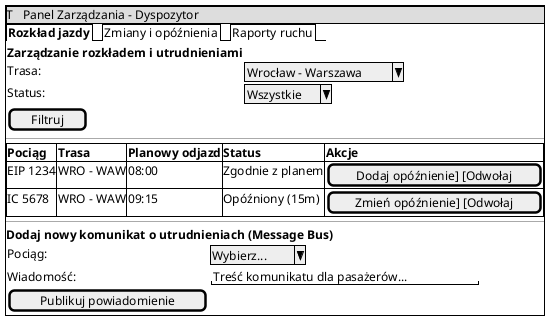
```plantuml
@startsalt
{+
  {* T | Panel Zarządzania - Dyspozytor }
  {/ <b>Rozkład jazdy</b> | Zmiany i opóźnienia | Raporty ruchu }
  {
    <b>Zarządzanie rozkładem i utrudnieniami</b>
    Trasa: | ^Wrocław - Warszawa^
    Status: | ^Wszystkie^
    [ Filtruj ]
  }
  ---
  {#
    <b>Pociąg</b> | <b>Trasa</b> | <b>Planowy odjazd</b> | <b>Status</b> | <b>Akcje</b>
    EIP 1234 | WRO - WAW | 08:00 | Zgodnie z planem | [Dodaj opóźnienie] [Odwołaj]
    IC 5678 | WRO - WAW | 09:15 | Opóźniony (15m) | [Zmień opóźnienie] [Odwołaj]
  }
  ---
  <b>Dodaj nowy komunikat o utrudnieniach (Message Bus)</b>
  {
    Pociąg: | ^Wybierz...^
    Wiadomość: | "Treść komunikatu dla pasażerów..."
    [ Publikuj powiadomienie ]
  }
}
@endsalt
```

Panel zarządzania - mapa ruchu
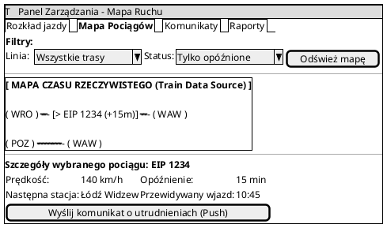
```plantuml
@startsalt
{+
  {* T | Panel Zarządzania - Mapa Ruchu }
  {/ Rozkład jazdy | <b>Mapa Pociągów</b> | Komunikaty | Raporty }
  {
    <b>Filtry:</b>
    Linia: | ^Wszystkie trasy^ | Status: | ^Tylko opóźnione^ | [ Odśwież mapę ]
  }
  ---
  {+
    <b>[ MAPA CZASU RZECZYWISTEGO (Train Data Source) ]</b>
    .
    ( WRO ) ----------- [> EIP 1234 (+15m)] ----------- ( WAW )
    .
    ( POZ ) ----------------------------------------- ( WAW )
  }
  ---
  <b>Szczegóły wybranego pociągu: EIP 1234</b>
  {
    Prędkość: | 140 km/h | Opóźnienie: | 15 min 
    Następna stacja: | Łódź Widzew | Przewidywany wjazd: | 10:45
  }
  [ Wyślij komunikat o utrudnieniach (Push) ]
}
@endsalt
```

Aplikacja pasażera - tablica odjazdów
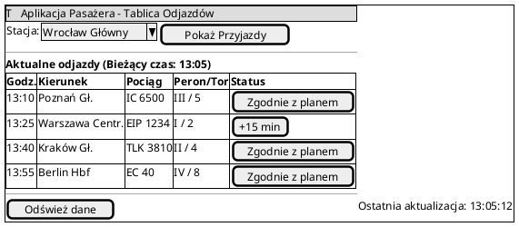
```plantuml
@startsalt
{+
  {* T | Aplikacja Pasażera - Tablica Odjazdów }
  {
    Stacja: | ^Wrocław Główny^ | [ Pokaż Przyjazdy ]
  }
  ---
  <b>Aktualne odjazdy (Bieżący czas: 13:05)</b>
  {#
    <b>Godz.</b> | <b>Kierunek</b> | <b>Pociąg</b> | <b>Peron/Tor</b> | <b>Status</b>
    13:10 | Poznań Gł. | IC 6500 | III / 5 | [Zgodnie z planem]
    13:25 | Warszawa Centr. | EIP 1234 | I / 2 | [+15 min]
    13:40 | Kraków Gł. | TLK 3810 | II / 4 | [Zgodnie z planem]
    13:55 | Berlin Hbf | EC 40 | IV / 8 | [Zgodnie z planem]
  }
  ---
  [ Odśwież dane ] | Ostatnia aktualizacja: 13:05:12
}
@endsalt
```

Panel managera - statystyki sprzedaży
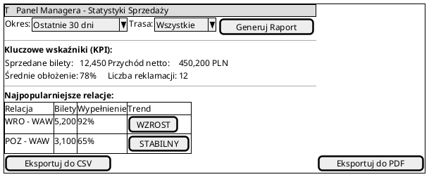
```plantuml
@startsalt
{+
  {* T | Panel Managera - Statystyki Sprzedaży }
  {
    Okres: | ^Ostatnie 30 dni^ | Trasa: | ^Wszystkie^ | [ Generuj Raport ]
  }
  ---
  <b>Kluczowe wskaźniki (KPI):</b>
  {
    Sprzedane bilety: | 12,450 | Przychód netto: | 450,200 PLN
    Średnie obłożenie: | 78% | Liczba reklamacji: | 12
  }
  ---
  <b>Najpopularniejsze relacje:</b>
  {#
    Relacja | Bilety | Wypełnienie | Trend
    WRO - WAW | 5,200 | 92% | [ WZROST ]
    POZ - WAW | 3,100 | 65% | [ STABILNY ]
  }
  [ Eksportuj do CSV ] | [ Eksportuj do PDF ]
}
@endsalt
```

Wybór i rezerwacja miejsca
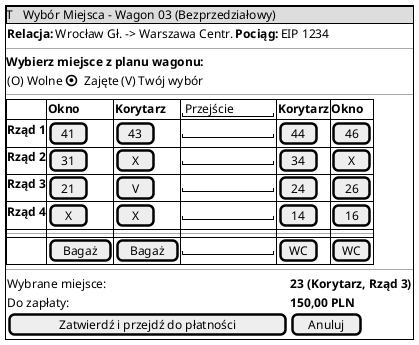
```plantuml
@startsalt
{+
  {* T | Wybór Miejsca - Wagon 03 (Bezprzedziałowy) }
  {
    <b>Relacja:</b> | Wrocław Gł. -> Warszawa Centr. | <b>Pociąg:</b> | EIP 1234
  }
  ---
  <b>Wybierz miejsce z planu wagonu:</b>
  {
    (O) Wolne | (X) Zajęte | (V) Twój wybór
  }
  ---
  {#
    . | <b>Okno</b> | <b>Korytarz</b> | " Przejście " | <b>Korytarz</b> | <b>Okno</b>
    <b>Rząd 1</b> | [ 41 ] | [ 43 ] | "           " | [ 44 ] | [ 46 ]
    <b>Rząd 2</b> | [ 31 ] | [  X ] | "           " | [ 34 ] | [  X ]
    <b>Rząd 3</b> | [ 21 ] | [  V ] | "           " | [ 24 ] | [ 26 ]
    <b>Rząd 4</b> | [  X ] | [  X ] | "           " | [ 14 ] | [ 16 ]
    --- | --- | --- | --- | --- | ---
    . | [ Bagaż ] | [ Bagaż ] | "           " | [ WC ] | [ WC ]
  }
  ---
  {
    Wybrane miejsce: | <b>23 (Korytarz, Rząd 3)</b>
    Do zapłaty: | <b>150,00 PLN</b>
    [ Zatwierdź i przejdź do płatności ] | [ Anuluj ]
  }
}
@endsalt
```

Aplikacja pasażera - dane pasażerów
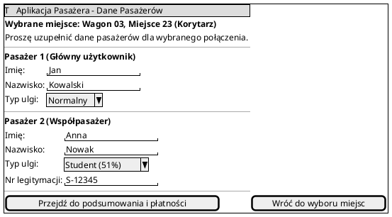
```plantuml
@startsalt
{+
  {* T | Aplikacja Pasażera - Dane Pasażerów }
  {
    <b>Wybrane miejsce: Wagon 03, Miejsce 23 (Korytarz)</b>
    Proszę uzupełnić dane pasażerów dla wybranego połączenia.
  }
  ---
  <b>Pasażer 1 (Główny użytkownik)</b>
  {
    Imię: | "Jan             "
    Nazwisko: | "Kowalski        "
    Typ ulgi: | ^Normalny^
  }
  ---
  <b>Pasażer 2 (Współpasażer)</b>
  {
    Imię: | "Anna            "
    Nazwisko: | "Nowak           "
    Typ ulgi: | ^Student (51%)^
    Nr legitymacji: | "S-12345         "
  }
  ---
  [ Przejdź do podsumowania i płatności ] | [ Wróć do wyboru miejsc ]
}
@endsalt
```

System płatności - checkout
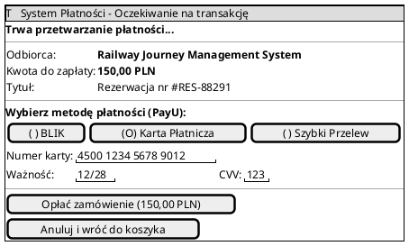
```plantuml
@startsalt
{+
  {* T | System Płatności - Oczekiwanie na transakcję }
  <b>Trwa przetwarzanie płatności...</b>
  ---
  {
    Odbiorca: | <b>Railway Journey Management System</b>
    Kwota do zapłaty: | <b>150,00 PLN</b>
    Tytuł: | Rezerwacja nr #RES-88291
  }
  ---
  <b>Wybierz metodę płatności (PayU):</b>
  {
    [ ( ) BLIK ] | [ (O) Karta Płatnicza ] | [ ( ) Szybki Przelew ]
  }
  {
    Numer karty: | "4500 1234 5678 9012"
    Ważność: | "12/28" | CVV: | "123"
  }
  ---
  [ Opłać zamówienie (150,00 PLN) ]
  [ Anuluj i wróć do koszyka ]
}
@endsalt
```

Aplikacja pasażera - bilet QR
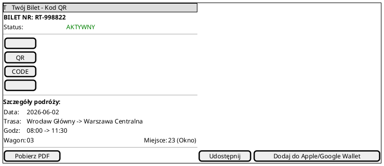
```plantuml
@startsalt
{+
  {* T | Twój Bilet - Kod QR }
  {
    <b>BILET NR: RT-998822</b>
    Status: | <color:green>AKTYWNY</color>
  }
  ---
  {
    [       ]
    [  QR   ]
    [  CODE ]
    [       ]
  }
  ---
  <b>Szczegóły podróży:</b>
  {
    Data: | 2026-06-02
    Trasa: | Wrocław Główny -> Warszawa Centralna
    Godz: | 08:00 -> 11:30
    Wagon: | 03 | Miejsce: | 23 (Okno)
  }
  ---
  [ Pobierz PDF ] | [ Udostępnij ] | [ Dodaj do Apple/Google Wallet ]
}
@endsalt
```

Panel pasażera - moje bilety i zwroty
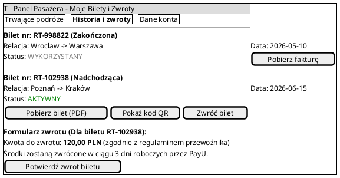
```plantuml
@startsalt
{+
  {* T | Panel Pasażera - Moje Bilety i Zwroty }
  {/ Trwające podróże | <b>Historia i zwroty</b> | Dane konta }
  ---
  <b>Bilet nr: RT-998822 (Zakończona)</b>
  Relacja: Wrocław -> Warszawa | Data: 2026-05-10
  Status: <color:gray>WYKORZYSTANY</color> | [ Pobierz fakturę ]
  ---
  <b>Bilet nr: RT-102938 (Nadchodząca)</b>
  Relacja: Poznań -> Kraków | Data: 2026-06-15
  Status: <color:green>AKTYWNY</color>
  {
    [ Pobierz bilet (PDF) ] | [ Pokaż kod QR ] | [ Zwróć bilet ]
  }
  ---
  <b>Formularz zwrotu (Dla biletu RT-102938):</b>
  Kwota do zwrotu: <b>120,00 PLN</b> (zgodnie z regulaminem przewoźnika)
  Środki zostaną zwrócone w ciągu 3 dni roboczych przez PayU.
  [ Potwierdź zwrot biletu ]
}
@endsalt
```

Aplikacja pasażera - centrum alarmowe
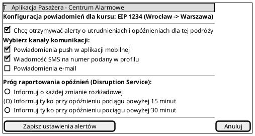
```plantuml
@startsalt
{+
  {* T | Aplikacja Pasażera - Centrum Alarmowe }
  <b>Konfiguracja powiadomień dla kursu: EIP 1234 (Wrocław -> Warszawa)</b>
  ---
  {
    [X] Chcę otrzymywać alerty o utrudnieniach i opóźnieniach dla tej podróży
  }
  <b>Wybierz kanały komunikacji:</b>
  {
    [X] Powiadomienia push w aplikacji mobilnej
    [X] Wiadomość SMS na numer podany w profilu
    [ ] Powiadomienia e-mail
  }
  ---
  <b>Próg raportowania opóźnień (Disruption Service):</b>
  {
    ( ) Informuj o każdej zmianie rozkładowej
    (O) Informuj tylko przy opóźnieniu pociągu powyżej 15 minut
    ( ) Informuj tylko przy opóźnieniu pociągu powyżej 30 minut
  }
  ---
  [ Zapisz ustawienia alertów ] | [ Anuluj ]
}
@endsalt
```

Panel przewoźnika - kreator oferty
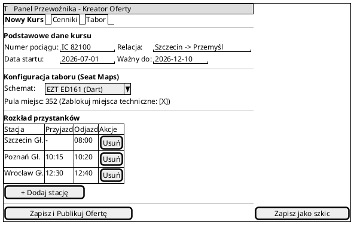
```plantuml
@startsalt
{+
  {* T | Panel Przewoźnika - Kreator Oferty }
  {/ <b>Nowy Kurs</b> | Cenniki | Tabor }
  ---
  <b>Podstawowe dane kursu</b>
  {
    Numer pociągu: | "IC 82100   " | Relacja: | "Szczecin -> Przemyśl"
    Data startu: | "2026-07-01 " | Ważny do: | "2026-12-10 "
  }
  ---
  <b>Konfiguracja taboru (Seat Maps)</b>
  {
    Schemat: | ^EZT ED161 (Dart)^
    Pula miejsc: | 352 (Zablokuj miejsca techniczne: [X])
  }
  ---
  <b>Rozkład przystanków</b>
  {#
    Stacja | Przyjazd | Odjazd | Akcje
    Szczecin Gł. | - | 08:00 | [Usuń]
    Poznań Gł. | 10:15 | 10:20 | [Usuń]
    Wrocław Gł. | 12:30 | 12:40 | [Usuń]
  }
  [ + Dodaj stację ]
  ---
  [ Zapisz i Publikuj Ofertę ] | [ Zapisz jako szkic ]
}
@endsalt
```

Panel przewoźnika - cenniki i oferty
```plantuml
@startsalt
{+
  {* T | Panel Przewoźnika - Cenniki i Oferty }
  {/ Oferta | <b>Cenniki</b> | Składy | Promocje }
  ---
  <b>Definiowanie stawek dla Trasy: Wrocław - Warszawa</b>
  {#
    Typ biletu | Cena Bazowa | Ulga 37% | Ulga 51% | Akcje
    Normalny | "150,00" | "94,50" | "73,50" | [Zapisz]
    Student | "75,00" | "47,25" | "36,75" | [Zapisz]
    Senior | "100,00" | "63,00" | "49,00" | [Zapisz]
  }
  [ + Dodaj nową kategorię ulgi ]
}
@endsalt
```

Panel dyspozytora - konflikt rozkładu
```plantuml
@startsalt
{+
  {* T | Panel Dyspozytora - Wykryto Konflikt Rozkładu! }
  {
    <b><color:red>BŁĄD ZAPISU: Zderzenie na szlaku!</color></b>
    Trasa: | Wrocław - Opole | Odcinek: | Brzeg - Lewin Brzeski
  }
  ---
  <b>Pociąg modyfikowany (Twój zaktualizowany rozkład):</b>
  IC 5678 | Odjazd z Brzegu: 10:15 | Wjazd do Lewina: 10:25
  ---
  <b>Pociąg kolidujący (Obecny w systemie bazy Schedule DB):</b>
  EIP 1234 | Odjazd z Brzegu: 10:20 | Wjazd do Lewina: 10:30
  ---
  <b>Wybierz akcję naprawczą:</b>
  ( ) Oznacz IC 5678 jako oczekujący (Opóźnienie +10 min)
  ( ) Oznacz EIP 1234 jako oczekujący (Wymaga zmiany rozkładu EIP)
  ( ) Anuluj modyfikację rozkładu
  [ Zatwierdź rozwiązanie ]
}
@endsalt
```

Aplikacja konduktora - kontrola biletów
```plantuml
@startsalt
{+
  {* T | Aplikacja Konduktora }
  {
    <b>Kontrola Biletów</b>
    [ Skanuj kod QR (Aparat) ]
    ---
    <b>Wprowadź kod ręcznie:</b>
    "                  " | [ Sprawdź ]
  }
  ---
  <b>Wynik ostatniej kontroli (Inspection Service):</b>
  {+
    <b>Status:</b> | <color:green>WAŻNY</color>
    <b>Pasażer:</b> | Jan Kowalski
    <b>Relacja:</b> | Wrocław - Warszawa
    <b>Wagon/Miejsce:</b> | 3 / 45
  }
  ---
  [Historia kontroli] | [Raporty] | [Wyloguj]
}
@endsalt
```

Aplikacja konduktora - log skanowania offline
```plantuml
@startsalt
{+
  {* T | Aplikacja Konduktora - Log Skanowania }
  {
    <b>Tryb:</b> | <color:red>OFFLINE (Brak zasięgu)</color>
    <b>Zsynchronizowano:</b> | 10 min temu
  }
  ---
  <b>Ostatnio zeskanowane (Lokalna baza):</b>
  {#
    Godz. | Bilet ID | Pasażer | Status | Wynik
    12:05 | RT-991 | J. Kowalski | WAŻNY | [ OK ]
    12:03 | RT-882 | A. Nowak | DUPLIKAT | [ ALERT ]
    12:00 | RT-773 | M. Wisła | WAŻNY | [ OK ]
  }
  ---
  [ Wymuś synchronizację ] | [ Raport zmianowy ]
}
@endsalt
```

Aplikacja konduktora - szczegóły błędu kontroli
```plantuml
@startsalt
{+
  {* T | Aplikacja Konduktora - Szczegóły Kontroli }
  <b><color:red>WERYFIKACJA NEGATYWNA (BŁĄD)</color></b>
  ---
  <b>Szczegóły biletu:</b>
  {
    ID Biletu: | RT-998822
    Odczytano: | 12:05:43
    Błąd: | <b>Duplikat! Bilet zeskanowany o 10:15.</b>
  }
  ---
  <b>Działania operacyjne:</b>
  {
    Wylegitymowano pasażera: | [X] Tak
    Rodzaj dokumentu: | ^Dowód Osobisty^
    Notatka (opcjonalnie): | "Pasażer twierdzi, że bilet wydrukował dwukrotnie..."
  }
  ---
  <b>Rejestracja zdarzenia (Inspection DB):</b>
  [ Wystaw opłatę dodatkową (Mandat) ]
  [ Oznacz jako wyjaśnione / Pouczenie ]
  [ Wróć do skanera ]
}
@endsalt
```

Aplikacja konduktora - kontrola ulgi
```plantuml
@startsalt
{+
  {* T | Aplikacja Konduktora - Kontrola Ulgi }
  <b><color:orange>STATUS KONTROLI: ZNIŻKA / WYMAGANA WERYFIKACJA</color></b>
  ---
  <b>Dane z biletu pasażera:</b>
  {
    Imię i nazwisko: | Anna Nowak
    Typ naliczonej zniżki: | <b>Student (51%)</b>
    Wymagany dokument: | <color:blue><b>Ustawowa legitymacja studencka</b></color>
  }
  ---
  {+
    <b>Instrukcja operacyjna dla drużyny konduktorskiej:</b>
    Sprawdź termin ważności fizycznego dokumentu / mLegitymacji
    oraz zgodność danych osobowych z wyświetlonymi powyżej.
  }
  ---
  <b>Decyzja konduktorska:</b>
  {
    [ Dokument POPRAWNY (Zatwierdź ważność biletu) ]
    --
    [ BRAK DOKUMENTU / NIEWAŻNY (Przejdź do nałożenia opłaty) ]
  }
  ---
  [ Wróć do skanowania QR ]
}
@endsalt
```

# 2.7 Ankieta Kano – System Zarządzania Transportem Pasażerskim i Pracowniczym

Szanowni Państwo,
Poniższa ankieta pomoże nam ocenić, które funkcje systemu są dla Państwa kluczowe, a które stanowią miły dodatek. Przy każdym z modułów prosimy o udzielenie **dwóch odpowiedzi**:
1. **Pytanie funkcjonalne (Pozytywne):** Jak się czujesz, gdy dana funkcja **jest obecna** w systemie?
2. **Pytanie dysfunkcjonalne (Negatywne):** Jak się czujesz, gdy danej funkcji **brakuje** w systemie?

---

### Instrukcja wyboru odpowiedzi (Skala Kano)
Dla każdego pytania wybierz jedną z 5 opcji:
* **A** – Bardzo mi się podoba (To dla mnie kluczowe/świetne)
* **B** – Oczekuję tego (To dla mnie standard)
* **C** – Jest mi to obojętne
* **D** – Mogę z tym żyć (Nie przeszkadza mi to)
* **E** – Bardzo mi się nie podoba (To niedopuszczalne)

---

## Moduł 1: Portal Zamówień i Sprzedaży

## Funkcja 1: Składanie zamówień na transport przez portal webowy
* **Pytanie funkcjonalne:** Jak byś się czuł, gdyby system umożliwiał składanie zamówień na jednorazowy transport pracowników przez intuicyjny portal webowy?
  - [ ] A | [ ] B | [ ] C | [ ] D | [ ] E
* **Pytanie dysfunkcjonalne:** Jak byś się czuł, gdyby system NIE umożliwiał składania zamówień przez portal webowy (zamówienia tylko telefonicznie/mailowo)?
  - [ ] A | [ ] B | [ ] C | [ ] D | [ ] E

## Funkcja 2: Zakup biletu wielo-przewoźnikowego w jednej transakcji (UC-02)
* **Pytanie funkcjonalne:** Jak byś się czuł, gdyby system pozwalał na zakup jednego wspólnego biletu na trasę obsługiwaną przez różnych przewoźników w ramach jednej płatności?
  - [ ] A | [ ] B | [ ] C | [ ] D | [ ] E
* **Pytanie dysfunkcjonalne:** Jak byś się czuł, gdyby system wymagał kupowania osobnych biletów u każdego przewoźnika dla podróży przesiadkowej?
  - [ ] A | [ ] B | [ ] C | [ ] D | [ ] E

## Funkcja 3: Rezerwacja miejsca na graficznym planie pojazdu/wagonu (UC-03)
* **Pytanie funkcjonalne:** Jak byś się czuł, gdyby interaktywny schemat pojazdu pozwalał na samodzielny wybór konkretnego fotela (okno, korytarz, stolik)?
  - [ ] A | [ ] B | [ ] C | [ ] D | [ ] E
* **Pytanie dysfunkcjonalne:** Jak byś się czuł, gdyby system przydzielał miejsca wyłącznie automatycznie, bez wizualnej mapy pojazdu?
  - [ ] A | [ ] B | [ ] C | [ ] D | [ ] E

---

## Moduł 2: Zarządzanie Operacyjne i Rozkłady

## Funkcja 4: Natychmiastowa edycja rozkładu jazdy online (UC-01)
* **Pytanie funkcjonalne:** Jak byś się czuł, gdyby edycja rozkładu przez dyspozytora automatycznie weryfikowała konflikty czasowe i aktualizowała plan pasażerom w czasie poniżej 60 sekund?
  - [ ] A | [ ] B | [ ] C | [ ] D | [ ] E
* **Pytanie dysfunkcjonalne:** Jak byś się czuł, gdyby zmiany w rozkładzie wymagały ręcznego sprawdzania konfliktów i aktualizowały się w systemie z dużym opóźnieniem?
  - [ ] A | [ ] B | [ ] C | [ ] D | [ ] E

## Funkcja 5: Automatyczne alerty o opóźnieniach w czasie rzeczywistym (UC-05)
* **Pytanie funkcjonalne:** Jak byś się czuł, gdyby system automatycznie wysyłał powiadomienia Push/SMS o opóźnieniach bezpośrednio do pasażerów przypisanych do danego kursu?
  - [ ] A | [ ] B | [ ] C | [ ] D | [ ] E
* **Pytanie dysfunkcjonalne:** Jak byś się czuł, gdyby pasażer musiał sam stale sprawdzać status tablicy odjazdów, aby dowiedzieć się o opóźnieniu pociągu/autobusu?
  - [ ] A | [ ] B | [ ] C | [ ] D | [ ] E

## Funkcja 6: Monitorowanie floty na żywo na mapie GPS (UC-06)
* **Pytanie funkcjonalne:** Jak byś się czuł, gdyby panel dyspozytora wyświetlał pozycję GPS wszystkich pojazdów na mapie w czasie rzeczywistym z odświeżaniem co 60 sekund?
  - [ ] A | [ ] B | [ ] C | [ ] D | [ ] E
* **Pytanie dysfunkcjonalne:** Jak byś się czuł, gdyby system nie posiadał mapy geolokalizacyjnej, a status pozycji pojazdu opierał się tylko na meldunkach ze stacji?
  - [ ] A | [ ] B | [ ] C | [ ] D | [ ] E

---

## Moduł 3: Kontrola i Raportowanie

## Funkcja 7: Błyskawiczne skanowanie kodów QR w trybie Offline (UC-08 / UC-09)
* **Pytanie funkcjonalne:** Jak byś się czuł, gdyby aplikacja kontrolera weryfikowała bilet (status ważny/nieważny/duplikat) w czasie poniżej 200 ms, działając w pełni bez zasięgu sieci (Offline)?
  - [ ] A | [ ] B | [ ] C | [ ] D | [ ] E
* **Pytanie dysfunkcjonalne:** Jak byś się czuł, gdyby brak zasięgu internetu w smartfonie/terminalu całkowicie uniemożliwiał weryfikację kodu QR pasażera?
  - [ ] A | [ ] B | [ ] C | [ ] D | [ ] E

## Funkcja 8: Automatyczne raporty sprzedaży i kontroli (BI) (UC-10)
* **Pytanie funkcjonalne:** Jak byś się czuł, gdyby system generował zaawansowane raporty obciążenia ruchu, przychodów i statystyk kontroli do plików CSV/PDF w kilka sekund?
  - [ ] A | [ ] B | [ ] C | [ ] D | [ ] E
* **Pytanie dysfunkcjonalne:** Jak byś się czuł, gdyby przygotowanie raportu z kontroli i sprzedaży wymagało ręcznego łączenia baz danych lub trwało powyżej minuty?
  - [ ] A | [ ] B | [ ] C | [ ] D | [ ] E

---

## Metryka Ewaluacji Wyników (Dla analityka)
Do interpretacji odpowiedzi z powyższej ankiety wykorzystaj poniższą macierz Kano:

| Pytanie Funkcjonalne \ Dysfunkcjonalne | A (Nie podoba się) | B (Mogę żyć) | C (Obojętne) | D (Oczekuję) | E (Podoba się) |
| :--- | :---: | :---: | :---: | :---: | :---: |
| **A (Podoba się)** | Kwestionowane (Q) | Atrakcyjne (A) | Atrakcyjne (A) | Atrakcyjne (A) | Jednowymiarowe (O) |
| **B (Oczekuję)** | Odwrotne (R) | Obojętne (I) | Obojętne (I) | Obojętne (I) | Obowiązkowe (M) |
| **C (Obojętne)** | Odwrotne (R) | Obojętne (I) | Obojętne (I) | Obojętne (I) | Odwrotne (R) |
| **D (Mogę żyć)** | Odwrotne (R) | Obojętne (I) | Obojętne (I) | Obojętne (I) | Odwrotne (R) |
| **E (Nie podoba się)** | Odwrotne (R) | Odwrotne (R) | Odwrotne (R) | Odwrotne (R) | Kwestionowane (Q) |

*Oznaczenia: **M** - Must-be (Obowiązkowe), **O** - One-dimensional (Jednowymiarowe/Im lepiej, tym lepiej), **A** - Attractive (Atrakcyjne), **I** - Indifferent (Obojętne), **R** - Reverse (Odwrotne), **Q** - Questionable (Kwestionowane).*
# Raport z Badania Kano – System Zarządzania Transportem

Dziękujemy za udział w ankiecie! Państwa odpowiedzi pomogą nam w określeniu priorytetów rozwoju systemu i dostarczeniu rozwiązania najlepiej odpowiadającego Państwa potrzebom.

### Skala odpowiedzi dla każdego pytania
* **1** – Podoba mi się to
* **2** – Tak powinno być
* **3** – Jestem neutralny
* **4** – Mogę z tym żyć
* **5** – Nie podoba mi się to

---

## 1. Zbiorcza Tabela Odpowiedzi Użytkowników

Poniższa tabela przedstawia surowe dane zebrane od 10 kluczowych użytkowników systemu dla 5 ocenianych funkcji ($F_x$). Litera **F** oznacza pytanie funkcjonalne (pozytywne), natomiast **D** oznacza pytanie dysfunkcjonalne (negatywne).

| Użytkownik | Rola | F1F | F1D | F2F | F2D | F3F | F3D | F4F | F4D | F5F | F5D |
| :--- | :--- | :---: | :---: | :---: | :---: | :---: | :---: | :---: | :---: | :---: | :---: |
| **U1** | Kontrahent | 1 | 5 | 2 | 4 | 1 | 1 | 3 | 3 | 4 | 5 |
| **U2** | Koordynator | 2 | 5 | 1 | 5 | 2 | 4 | 1 | 4 | 1 | 5 |
| **U3** | Kierowca | 1 | 4 | 2 | 5 | 5 | 2 | 2 | 4 | 2 | 4 |
| **U4** | Kontrahent | 2 | 5 | 1 | 5 | 3 | 3 | 1 | 5 | 1 | 5 |
| **U5** | Administrator | 1 | 5 | 2 | 4 | 5 | 5 | 2 | 4 | 3 | 3 |
| **U6** | Koordynator | 2 | 4 | 1 | 5 | 1 | 4 | 1 | 5 | 2 | 5 |
| **U7** | Kontrahent | 1 | 5 | 3 | 3 | 2 | 5 | 4 | 2 | 1 | 4 |
| **U8** | Kierowca | 4 | 2 | 2 | 5 | 4 | 3 | 3 | 3 | 4 | 2 |
| **U9** | Kontrahent | 1 | 5 | 1 | 5 | 4 | 1 | 1 | 5 | 1 | 5 |
| **U10** | Koordynator | 2 | 5 | 2 | 4 | 3 | 4 | 2 | 4 | 2 | 4 |

---

## 2. Klasyfikacja Wyników według Tabeli Ewaluacyjnej

### Funkcja 1: Portal webowy do zamówień
* **Rozkład:** Performance (40%), Must-be (30%), Indifferent (20%), Attractive (10%)

| Użytkownik | Funkcjonalne | Dysfunkcjonalne | Klasyfikacja |
| :--- | :---: | :---: | :--- |
| **U1** | 1 | 5 | Performance |
| **U2** | 2 | 5 | Must-be |
| **U3** | 1 | 4 | Attractive |
| **U4** | 2 | 5 | Must-be |
| **U5** | 1 | 5 | Performance |
| **U6** | 2 | 4 | Indifferent |
| **U7** | 1 | 5 | Performance |
| **U8** | 4 | 2 | Indifferent |
| **U9** | 1 | 5 | Performance |
| **U10** | 2 | 5 | Must-be |

### Funkcja 2: Automatyczne przydzielanie zasobów
* **Rozkład:** Performance (40%), Indifferent (40%), Must-be (20%)

| Użytkownik | Funkcjonalne | Dysfunkcjonalne | Klasyfikacja |
| :--- | :---: | :---: | :--- |
| **U1** | 2 | 4 | Indifferent |
| **U2** | 1 | 5 | Performance |
| **U3** | 2 | 5 | Must-be |
| **U4** | 1 | 5 | Performance |
| **U5** | 2 | 4 | Indifferent |
| **U6** | 1 | 5 | Performance |
| **U7** | 3 | 3 | Indifferent |
| **U8** | 2 | 5 | Must-be |
| **U9** | 1 | 5 | Performance |
| **U10** | 2 | 4 | Indifferent |

### Funkcja 3: Zapisywanie adresów
* **Rozkład:** Indifferent (40%), Questionable (20%), Reverse (20%), Attractive (10%), Must-be (10%)

| Użytkownik | Funkcjonalne | Dysfunkcjonalne | Klasyfikacja |
| :--- | :---: | :---: | :--- |
| **U1** | 1 | 1 | Questionable |
| **U2** | 2 | 4 | Indifferent |
| **U3** | 5 | 2 | Reverse |
| **U4** | 3 | 3 | Indifferent |
| **U5** | 5 | 5 | Questionable |
| **U6** | 1 | 4 | Attractive |
| **U7** | 2 | 5 | Must-be |
| **U8** | 4 | 3 | Indifferent |
| **U9** | 4 | 1 | Reverse |
| **U10** | 3 | 4 | Indifferent |

### Funkcja 4: Powiadomienia o potwierdzeniu
* **Rozkład:** Indifferent (60%), Performance (30%), Attractive (10%)

| Użytkownik | Funkcjonalne | Dysfunkcjonalne | Klasyfikacja |
| :--- | :---: | :---: | :--- |
| **U1** | 3 | 3 | Indifferent |
| **U2** | 1 | 4 | Attractive |
| **U3** | 2 | 4 | Indifferent |
| **U4** | 1 | 5 | Performance |
| **U5** | 2 | 4 | Indifferent |
| **U6** | 1 | 5 | Performance |
| **U7** | 4 | 2 | Indifferent |
| **U8** | 3 | 3 | Indifferent |
| **U9** | 1 | 5 | Performance |
| **U10** | 2 | 4 | Indifferent |

### Funkcja 5: Widok kalendarza
* **Rozkład:** Indifferent (40%), Performance (30%), Must-be (20%), Attractive (10%)

| Użytkownik | Funkcjonalne | Dysfunkcjonalne | Klasyfikacja |
| :--- | :---: | :---: | :--- |
| **U1** | 4 | 5 | Must-be |
| **U2** | 1 | 5 | Performance |
| **U3** | 2 | 4 | Indifferent |
| **U4** | 1 | 5 | Performance |
| **U5** | 3 | 3 | Indifferent |
| **U6** | 2 | 5 | Must-be |
| **U7** | 1 | 4 | Attractive |
| **U8** | 4 | 2 | Indifferent |
| **U9** | 1 | 5 | Performance |
| **U10** | 2 | 4 | Indifferent |

---

## 3. Analiza Wskaźników Satysfakcji i Niezadowolenia

### Formuły przeliczeniowe
Do wyznaczenia poziomu wpływu cechy na użytkownika stosuje się następujące wzory (odpowiedzi *Questionable* oraz *Reverse* są pomijane w mianowniku, jako niedotyczące bezpośredniej skali satysfakcji):

$$\text{Wskaźnik satysfakcji (SI)} = \frac{\text{Attractive} + \text{Performance}}{\text{Attractive} + \text{Performance} + \text{Must-be} + \text{Indifferent}}$$

$$\text{Wskaźnik niezadowolenia (DI)} = -1 \cdot \left(\frac{\text{Must-be} + \text{Performance}}{\text{Attractive} + \text{Performance} + \text{Must-be} + \text{Indifferent}}\right)$$

### Wyniki szczegółowe dla funkcjonalności:

* **Funkcja 1: Portal webowy do zamówień**
  * Statystyki: $A: 1, P: 4, M: 3, I: 2, R: 0, Q: 0$
  * Wskaźnik satysfakcji: $(1+4) / (1+4+3+2) = 5/10 = 0.50$
  * Wskaźnik niezadowolenia: $-(3+4) / (1+4+3+2) = -7/10 = -0.70$
* **Funkcja 2: Automatyczne przydzielanie zasobów**
  * Statystyki: $A: 0, P: 4, M: 2, I: 4, R: 0, Q: 0$
  * Wskaźnik satysfakcji: $(0+4) / (0+4+2+4) = 4/10 = 0.40$
  * Wskaźnik niezadowolenia: $-(2+4) / (0+4+2+4) = -6/10 = -0.60$
* **Funkcja 3: Zapisywanie adresów**
  * Statystyki: $A: 1, P: 0, M: 1, I: 4, R: 2, Q: 2$
  * Wskaźnik satysfakcji: $(1+0) / (1+0+1+4) = 1/6 \approx 0.17$
  * Wskaźnik niezadowolenia: $-(1+0) / (1+0+1+4) = -1/6 \approx -0.17$
* **Funkcja 4: Powiadomienia o potwierdzeniu**
  * Statystyki: $A: 1, P: 3, M: 0, I: 6, R: 0, Q: 0$
  * Wskaźnik satysfakcji: $(1+3) / (1+3+0+6) = 4/10 = 0.40$
  * Wskaźnik niezadowolenia: $-(0+3) / (1+3+0+6) = -3/10 = -0.30$
* **Funkcja 5: Widok kalendarza**
  * Statystyki: $A: 1, P: 3, M: 2, I: 4, R: 0, Q: 0$
  * Wskaźnik satysfakcji: $(1+3) / (1+3+2+4) = 4/10 = 0.40$
  * Wskaźnik niezadowolenia: $-(2+3) / (1+3+2+4) = -5/10 = -0.50$

---

## 4. Macierz Priorytetów i Wnioski

Poniższy ranking wskazuje kolejność implementacji modułów systemu na podstawie uzyskanych współczynników.

| Funkcja | Satysfakcja | Niezadowolenie | Priorytet |
| :--- | :---: | :---: | :--- |
| **F1: Portal webowy do zamówień** | 0.50 | -0.70 | **Bardzo wysoki** |
| **F2: Automatyczne przydzielanie zasobów** | 0.40 | -0.60 | **Wysoki** |
| **F5: Widok kalendarza** | 0.40 | -0.50 | **Średni** |
| **F4: Powiadomienia o potwierdzeniu** | 0.40 | -0.30 | **Średni** |
| **F3: Zapisywanie adresów** | 0.17 | -0.17 | **Niski** |

---

## Appendix: Tabela ewaluacyjna modelu Kano (Klucz klasyfikacji)

| Pytanie Funkcjonalne \ Dysfunkcjonalne | 1. Podoba mi się | 2. Tak powinno być | 3. Neutralny | 4. Mogę z tym żyć | 5. Nie podoba mi się |
| :--- | :---: | :---: | :---: | :---: | :---: |
| **1. Podoba mi się** | Q | A | A | A | P |
| **2. Tak powinno być** | R | I | I | I | M |
| **3. Neutralny** | R | I | I | I | M |
| **4. Mogę z tym żyć** | R | I | I | I | M |
| **5. Nie podoba mi się** | R | R | R | R | Q |

* **A** (Attractive) – Atrakcyjne
* **P** (Performance) – Wydajnościowe (Jednowymiarowe)
* **M** (Must-be) – Obowiązkowe
* **I** (Indifferent) – Obojętne
* **R** (Reverse) – Odwrotne
* **Q** (Questionable) – Wątpliwe / Wadliwe