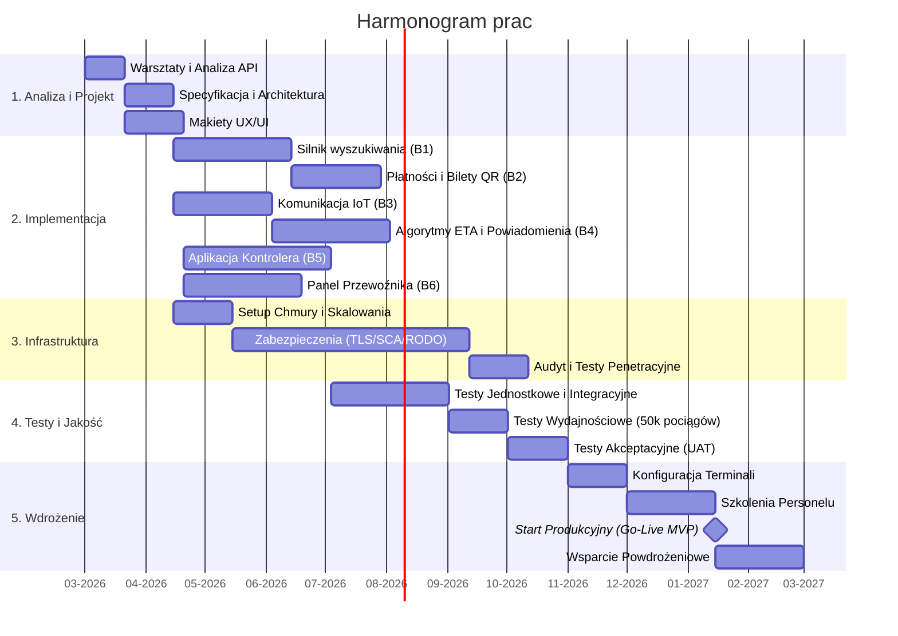

# OFERTA NA SYSTEM ZARZĄDZANIA TRANSPORTEM PASAŻERSKIM

## 1. Wizja projektu 

Stworzyć kompleksowy system zarządzania transportem pasażerskim, który umożliwi przewoźnikom efektywne zarządzanie ofertą i operacjami, automatyzując procesy od planowania rozkładów, przez sprzedaż biletów i monitoring ruchu, aż po weryfikację uprawnień i raportowanie finansowe. System zapewni pełną cyfryzację dzięki portalowi dla pasażerów, zaawansowanemu modułowi zarządzania dla przewoźników oraz narzędziom mobilnym dla pracowników terenowych.

---

## 1.1. Aktorzy w systemie 

### 1. Pasażer
**Opis roli:** Główny użytkownik końcowy systemu, korzystający z usług transportowych oferowanych przez przewoźników.

* **Cele:**
    * Szybkie znalezienie optymalnego połączenia (czas, cena, przesiadki).
    * Wygodny zakup biletów u wielu przewoźników w ramach jednej płatności.
    * Monitorowanie podróży w czasie rzeczywistym i otrzymywanie powiadomień o utrudnieniach.
    * Wybór konkretnego miejsca w pociągu dla zwiększenia komfortu.
* **Interakcje z systemem:**
    * Wyszukiwanie połączeń i przeglądanie rozkładów jazdy.
    * Zarządzanie koszykiem zakupowym i realizacja płatności.
    * Wybór miejsc na interaktywnym planie wagonu.
    * Odbieranie powiadomień push/SMS o opóźnieniach i komunikatów specjalnych.
    * Okazywanie kodu QR biletu do kontroli.
* **Charakterystyka:** Użytkownik mobilny, oczekujący szybkości działania (wyniki < 2-3 s) oraz przejrzystości informacji o cenach i zniżkach.

---

### 2. Przewoźnik
**Opis roli:** Podmiot biznesowy dostarczający usługi transportowe, odpowiedzialny za ofertę i dane operacyjne.

* **Cele:**
    * Zarządzanie ofertą przewozową (trasy, cenniki, klasy).
    * Utrzymywanie aktualności rozkładów jazdy.
    * Analiza efektywności sprzedaży i kontroli biletów poprzez raportowanie.
* **Interakcje z systemem:**
    * Edycja i aktualizacja rozkładów jazdy (wymaga uwierzytelnienia).
    * Definiowanie nowych tras, cenników i dostępnych klas biletów.
    * Generowanie i pobieranie raportów (CSV/PDF) dotyczących przychodów i obciążenia ruchu.
    * Monitorowanie ewentualnych konfliktów czasowych na swoich liniach.
* **Charakterystyka:** Użytkownik profesjonalny, kładący nacisk na integralność danych, bezpieczeństwo (autoryzacja) oraz analitykę biznesową.

---

### 3. Dyspozytor
**Opis roli:** Pracownik operacyjny odpowiedzialny za bieżący nadzór nad ruchem pociągów i komunikację kryzysową.

* **Cele:**
    * Bieżący monitoring pozycji pociągów w celu zapewnienia płynności ruchu.
    * Szybkie informowanie pasażerów o awariach i zmianach organizacyjnych.
* **Interakcje z systemem:**
    * Korzystanie z mapy geolokalizacyjnej (GPS/GSM) pociągów.
    * Analiza parametrów pociągu (prędkość, opóźnienie, status sygnału).
    * Wprowadzanie komunikatów specjalnych i informacji o awariach przypisanych do linii/stacji.
* **Charakterystyka:** Wymaga dostępu do danych w czasie rzeczywistym (odświeżanie co 60 s lub częściej) oraz narzędzi do natychmiastowego rozgłaszania informacji.

---

### 4. Kontroler
**Opis roli:** Pracownik terenowy odpowiedzialny za weryfikację uprawnień pasażerów do przejazdu.

* **Cele:**
    * Błyskawiczna weryfikacja ważności biletów w różnych warunkach oświetleniowych.
    * Wykrywanie nadużyć (duplikaty, brak dokumentów do zniżek).
* **Interakcje z systemem:**
    * Skanowanie kodów QR (skupienie na wydajności < 200 ms).
    * Praca w trybie offline z lokalną bazą danych.
    * Rejestrowanie incydentów (np. próba użycia duplikatu biletu).
    * Przeglądanie historii skanowań na urządzeniu mobilnym.
* **Charakterystyka:** Pracuje w dynamicznym środowisku (często bez dostępu do sieci), potrzebuje bardzo czytelnych komunikatów wizualnych (kodowanie kolorami).

---

## 1.2. Przypadki użycia 

### 1.2.1 Rozkład jazdy i planowanie podróży

#### UC-01: Edycja rozkładu jazdy

**Powiązana historia użytkownika:**  
Jako przewoźnik chcę edytować rozkład jazdy, aby zmiany były natychmiast widoczne w systemie.

**Główny aktor:**  
Przewoźnik / Dyspozytor

**Warunki wstępne:**

- Użytkownik jest zalogowany do systemu z odpowiednimi uprawnieniami.
- Nastąpiła potrzeba zmiany rozkładu jazdy, np. awaria, zamknięcie toru, zmiana operacyjna lub korekta planu kursowania.
- System posiada aktualne dane rozkładowe oraz informacje o trasach i kursach.

**Przepływ główny:**

1. Użytkownik wybiera w systemie opcję edycji rozkładu jazdy.
2. System wyświetla listę aktywnych tras, kursów i pociągów.
3. Użytkownik wyszukuje i wybiera kurs wymagający zmiany.
4. System wyświetla aktualny rozkład jazdy dla wybranego kursu.
5. Użytkownik edytuje parametry rozkładu, np. godzinę odjazdu, godzinę przyjazdu, opóźnienie, objazd lub pominięcie stacji.
6. System weryfikuje zmodyfikowany rozkład pod kątem konfliktów czasowych na tej samej linii.
7. Użytkownik zatwierdza zmiany.
8. System zapisuje zmianę w bazie danych wraz z datą i autorem modyfikacji.
9. System publikuje aktualizację rozkładu tak, aby była widoczna dla pasażerów w czasie poniżej 60 sekund.

**Przepływy alternatywne:**

**A1: Wykrycie konfliktu w rozkładzie**

1. System wykrywa konflikt czasowy na tej samej linii.
2. System blokuje zapis zmiany.
3. System informuje użytkownika o przyczynie konfliktu.
4. Użytkownik koryguje dane i ponawia próbę zapisu.

**A2: Całkowite odwołanie kursu**

1. Użytkownik zamiast edycji trasy oznacza kurs jako odwołany.
2. System usuwa kurs z aktywnych rozkładów.
3. System zapisuje informację o odwołaniu kursu.
4. System publikuje zmianę w systemie pasażerskim.

**Warunki końcowe:**

- **Sukces:** Rozkład jazdy zostaje zaktualizowany, a zmiana jest widoczna dla pasażerów w czasie poniżej 60 sekund.
- **Błąd:** Rozkład jazdy nie zostaje zmieniony, a użytkownik otrzymuje informację o przyczynie niepowodzenia.

---

### 1.2.2 Sprzedaż biletów i rezerwacja miejsc

#### UC-02: Zakup biletu wielo-przewoźnikowego

**Powiązana historia użytkownika:**  
Jako pasażer chcę kupić bilet u wielu przewoźników w jednej transakcji, aby ułatwić podróż wielo-przewoźnikową.

**Główny aktor:**  
Pasażer

**Warunki wstępne:**

- Pasażer wyszukał połączenie w wyszukiwarce.
- Wybrane połączenie składa się z co najmniej jednego odcinka trasy.

**Przepływ główny:**

1. Pasażer dodaje wybrane połączenie, które może zawierać wielu przewoźników, do koszyka.
2. System wyświetla podsumowanie koszyka z listą wszystkich odcinków i łączną kwotą.
3. Pasażer wybiera opcję „Przejdź do płatności”.
4. System przekierowuje pasażera do zewnętrznego operatora płatności.
5. Pasażer dokonuje płatności za całe zamówienie.
6. System otrzymuje potwierdzenie autoryzacji płatności.
7. System generuje jeden zbiorczy bilet elektroniczny lub pakiet biletów pod jednym identyfikatorem.
8. System wysyła bilet na adres e-mail pasażera i zapisuje go na jego koncie.

**Przepływy alternatywne:**

**A1: Nieudana autoryzacja płatności**

1. System otrzymuje informację o odrzuceniu transakcji.
2. System wyświetla komunikat o błędzie płatności.
3. System umożliwia ponowną próbę płatności lub powrót do koszyka.

**A2: Wygaśnięcie sesji lub rezerwacji w trakcie płatności**

1. Pasażer zwleka z płatnością zbyt długo.
2. System informuje o wygaśnięciu czasu na zakup.
3. System zwalnia zablokowane miejsca lub bilety.
4. Pasażer zostaje przekierowany do strony głównej wyszukiwarki.

**A3: Błąd komunikacji z API jednego z przewoźników**

1. System nie może potwierdzić rezerwacji u jednego z partnerów.
2. System automatycznie inicjuje zwrot środków, jeśli zostały pobrane.
3. Pasażer otrzymuje komunikat o braku możliwości wystawienia biletu zbiorczego.
4. System informuje pasażera o konieczności kontaktu z biurem obsługi.

**Warunki końcowe:**

- **Sukces:** Pasażer posiada ważny dokument podróży, np. plik PDF lub kod QR, środki zostały przekazane przewoźnikom, a transakcja widnieje w historii zamówień.
- **Błąd:** Środki nie zostają pobrane albo zostają zwrócone, a miejsca w pociągach pozostają wolne w systemie sprzedaży.

---

#### UC-03: Wybór i rezerwacja miejsca na planie wagonu

**Powiązana historia użytkownika:**  
Jako pasażer chcę wybrać miejsce na planie wagonu, aby dopasować komfort podróży.

**Główny aktor:**  
Pasażer

**Warunki wstępne:**

- Pasażer jest w procesie zakupu biletu, przed płatnością.
- Przewoźnik udostępnia interaktywny plan składu pociągu.

**Przepływ główny:**

1. Pasażer wybiera opcję „Wybierz miejsce” przy konkretnym kursie.
2. System wyświetla interaktywny schemat składu pociągu z podziałem na wagony i klasy.
3. System oznacza miejsca zajęte jako nieaktywne, a miejsca wolne jako możliwe do wyboru.
4. Pasażer klika ikonę wybranego wolnego miejsca.
5. System wizualnie zatwierdza wybór i przypisuje numer miejsca do biletu w koszyku.
6. Pasażer zatwierdza wybór przyciskiem „Potwierdź wybór miejsc”.
7. System czasowo blokuje wybrane miejsca na czas trwania transakcji.
8. Po sfinalizowaniu płatności system trwale rezerwuje miejsca i nanosi ich numery na bilet.

**Przepływy alternatywne:**

**A1: Brak dostępności miejsc obok siebie dla biletów grupowych**

1. System informuje o braku wolnych miejsc w wybranym wagonie.
2. Pasażer zmienia wagon za pomocą nawigacji w schemacie składu.

**A2: Miejsce zajęte w ostatniej chwili**

1. W momencie kliknięcia w ikonę miejsca inny użytkownik zdążył już zablokować to miejsce.
2. System odświeża status miejsca na „zajęte”.
3. System wyświetla komunikat o konieczności wyboru innego fotela.

**A3: Przewoźnik nie udostępnia graficznego planu**

1. System zamiast mapy wyświetla listę preferencji, np. „okno”, „korytarz”, „miejsce przy stoliku”.
2. System automatycznie przydziela najlepsze dostępne miejsce na podstawie wybranych kryteriów.

**Warunki końcowe:**

- **Sukces:** Wybrane identyfikatory miejsc są powiązane z pozycją w koszyku i czasowo zablokowane w bazie danych pociągu ze statusem `pending`.
- **Błąd:** Miejsce nie zostaje przypisane, system wymusza ponowny wybór lub przydziela miejsce automatycznie, zależnie od konfiguracji.

---

#### UC-04: Zarządzanie ofertą przewozową przez przewoźnika

**Powiązana historia użytkownika:**  
Jako przewoźnik chcę dodawać i aktualizować ofertę przewozową, aby sprzedaż była aktualna.

**Główny aktor:**  
Przewoźnik

**Warunki wstępne:**

- Użytkownik jest zalogowany z uprawnieniami przewoźnika.

**Przepływ główny:**

1. Przewoźnik wybiera opcję „Zarządzaj ofertą” w panelu administracyjnym.
2. System wyświetla listę aktualnych tras i kursów.
3. Przewoźnik wybiera opcję „Dodaj nową ofertę” lub edytuje istniejącą.
4. Przewoźnik definiuje parametry trasy, cennik dla poszczególnych klas oraz daty kursowania.
5. Przewoźnik zatwierdza zmiany przyciskiem „Zapisz i publikuj”.
6. System weryfikuje kompletność danych, np. czy podano cenę i datę, oraz sprawdza, czy oferta nie jest duplikatem.
7. System zapisuje zmiany w bazie danych.
8. System aktualizuje ofertę w module sprzedaży tak, aby była widoczna dla pasażerów w czasie poniżej 5 minut.

**Przepływy alternatywne:**

**A1: Błędne dane wejściowe**

1. System wykrywa brak ceny lub ujemną wartość.
2. System podświetla pola z błędami na czerwono i blokuje przycisk „Zapisz”.
3. Przewoźnik koryguje dane i ponawia próbę.

**A2: Konflikt w rozkładzie jazdy lub duplikacja oferty**

1. System wykrywa, że na danej trasie o tej samej godzinie i tym samym numerze pociągu istnieje już aktywna oferta.
2. System odrzuca zapis.
3. System wyświetla komunikat o konflikcie z istniejącym kursem.

**A3: Usunięcie lub wyłączenie oferty z aktywną sprzedażą**

1. Przewoźnik próbuje usunąć ofertę, na którą sprzedano już bilety.
2. System blokuje usuwanie.
3. System sugeruje opcję „Wycofaj ze sprzedaży”, która blokuje nowe zakupy przy zachowaniu ważności już sprzedanych biletów.

**Warunki końcowe:**

- **Sukces:** Nowa lub zmodyfikowana oferta jest zapisana w bazie danych, posiada unikalny identyfikator i jest gotowa do wyświetlenia pasażerom.
- **Błąd:** Dane w bazie pozostają niezmienione, następuje rollback, a przewoźnik widzi komunikat o przyczynie niepowodzenia operacji.

---

### 4.2.3 Informacje o opóźnieniach

#### UC-05: Otrzymanie powiadomienia o opóźnieniu

**Powiązana historia użytkownika:**  
Jako pasażer chcę otrzymywać powiadomienia o aktualnych opóźnieniach mojego pociągu w czasie rzeczywistym.

**Główny aktor:**  
Pasażer

**Warunki wstępne:**

- System wykrył opóźnienie pociągu przekraczające ustalony próg.
- Pasażer posiada aktywny bilet na dany kurs lub obserwuje daną podróż.
- Pasażer ma włączone powiadomienia dla tej podróży.

**Przepływ główny:**

1. System wykrywa opóźnienie pociągu przekraczające ustalony próg.
2. System identyfikuje pasażerów powiązanych z danym kursem.
3. System przygotowuje treść powiadomienia zawierającą numer pociągu, aktualną stację lub lokalizację, wielkość opóźnienia oraz przewidywany czas przyjazdu.
4. System wysyła powiadomienie push lub SMS do pasażera.
5. Pasażer odbiera powiadomienie.
6. Pasażer otwiera komunikat i zapoznaje się ze szczegółami opóźnienia.

**Przepływy alternatywne:**

**A1: Pasażer ma wyłączone powiadomienia**

1. System nie wysyła powiadomienia do pasażera.
2. Informacja o opóźnieniu pozostaje dostępna w szczegółach podróży.

**A2: Zmiana opóźnienia po wysłaniu komunikatu**

1. System ponownie wylicza opóźnienie i przewidywany czas przyjazdu.
2. Jeżeli zmiana jest istotna, system wysyła zaktualizowane powiadomienie do pasażera.

**Warunki końcowe:**

- **Sukces:** Pasażer zostaje poinformowany o opóźnieniu pociągu.
- **Błąd:** Powiadomienie nie zostaje wysłane, ale informacja pozostaje dostępna w szczegółach podróży.

---

#### UC-06: Monitorowanie geolokalizacji pociągów na mapie

**Powiązana historia użytkownika:**  
Jako dyspozytor chcę widzieć geolokalizację pociągów na mapie, aby monitorować ruch.

**Główny aktor:**  
Dyspozytor

**Warunki wstępne:**

- Dyspozytor ma dostęp do systemu RailTravel.
- System posiada aktualny rozkład jazdy.
- System odbiera dane lokalizacyjne z modułów GPS+GSM pojazdów.
- W systemie istnieją aktywne kursy pociągów.

**Przepływ główny:**

1. Dyspozytor otwiera moduł mapy geolokalizacyjnej.
2. System pobiera aktualne dane lokalizacyjne aktywnych pociągów.
3. System wyświetla pozycje pociągów na mapie.
4. System odświeża pozycje pociągów w czasie nie dłuższym niż 60 sekund.
5. Dyspozytor klika ikonę wybranego pociągu.
6. System wyświetla szczegóły pociągu: numer, trasę, opóźnienie i prędkość.
7. Dyspozytor analizuje status ruchu pociągów.

**Przepływy alternatywne:**

**A1: Utrata sygnału GPS**

1. System nie otrzymuje aktualnej lokalizacji pociągu.
2. System wyróżnia ikonę pociągu jako „sygnał utracony”.
3. System wyświetla ostatnią znaną lokalizację pociągu.

**A2: Brak danych lokalizacyjnych dla pociągu**

1. System nie posiada danych GPS dla wybranego pociągu.
2. System informuje dyspozytora o braku aktualnych danych.
3. Dyspozytor może odświeżyć widok lub sprawdzić inne dane operacyjne.

**Warunki końcowe:**

- **Sukces:** Dyspozytor widzi aktualne pozycje aktywnych pociągów na mapie.
- **Błąd:** System nie może wyświetlić aktualnych danych lokalizacyjnych i prezentuje ostatni znany status.

---

#### UC-07: Wprowadzenie awarii i komunikatów specjalnych

**Powiązana historia użytkownika:**  
Jako dyspozytor chcę wprowadzać awarie i komunikaty specjalne, aby informować pasażerów.

**Główny aktor:**  
Dyspozytor

**Warunki wstępne:**

- Dyspozytor jest zalogowany do systemu z odpowiednimi uprawnieniami.
- Dyspozytor zidentyfikował awarię, utrudnienie lub zmianę organizacyjną.
- System umożliwia przypisanie komunikatu do konkretnej linii lub stacji.

**Przepływ główny:**

1. Dyspozytor wybiera opcję wprowadzenia komunikatu specjalnego.
2. Dyspozytor przypisuje komunikat do konkretnej linii, stacji lub kursu.
3. Dyspozytor uzupełnia obowiązkowe pola: tytuł, treść oraz czas obowiązywania.
4. Dyspozytor zatwierdza publikację komunikatu.
5. System zapisuje komunikat w bazie danych.
6. System publikuje komunikat w aplikacji pasażerskiej w czasie poniżej 60 sekund.
7. System wysyła powiadomienia push lub SMS do pasażerów powiązanych z daną podróżą, jeżeli są dostępni.
8. System wyświetla komunikat na tablicach informacyjnych, jeżeli są zintegrowane z systemem.
9. Po upływie czasu obowiązywania system automatycznie archiwizuje komunikat.

**Przepływy alternatywne:**

**A1: Brak przypisanych pasażerów**

1. System nie znajduje pasażerów przypisanych do danej linii, stacji lub kursu.
2. System nie generuje wysyłki bezpośrednich powiadomień push lub SMS.
3. System publikuje komunikat w aplikacji oraz na ogólnodostępnych tablicach informacyjnych.

**A2: Brak wymaganych pól komunikatu**

1. Dyspozytor próbuje zapisać komunikat bez tytułu, treści lub czasu obowiązywania.
2. System blokuje zapis.
3. System wskazuje brakujące pola.
4. Dyspozytor uzupełnia dane i ponawia zapis.

**Warunki końcowe:**

- **Sukces:** Komunikat o awarii lub utrudnieniu zostaje zarejestrowany, opublikowany i widoczny dla pasażerów.
- **Błąd:** Komunikat nie zostaje opublikowany, a dyspozytor otrzymuje informację o przyczynie niepowodzenia.

---

### 1.2.4 Kontrola biletów

#### UC-08: Skanowanie kodu QR biletu

**Powiązana historia użytkownika:**  
Jako kontroler chcę zeskanować kod QR biletu w czasie poniżej 200 ms, aby przeprowadzać kontrolę szybciej.

**Główny aktor:**  
Kontroler

**Aktorzy wspierający:**  
Pasażer

**Warunki wstępne:**

- Kontroler rozpoczął kontrolę biletów w pociągu.
- Pasażer posiada bilet z kodem QR w formie elektronicznej lub papierowej.
- Urządzenie kontrolera ma uruchomioną aplikację kontrolerską.
- Aplikacja posiada dostęp do lokalnej kopii bazy biletów umożliwiającej pracę offline.
- Kod QR jest możliwy do okazania kontrolerowi.

**Przepływ główny:**

1. Kontroler podchodzi do pasażera i prosi o okazanie biletu.
2. Pasażer okazuje bilet z kodem QR.
3. Kontroler uruchamia funkcję skanowania biletu w aplikacji.
4. Kontroler kieruje skaner lub kamerę urządzenia na kod QR biletu.
5. System odczytuje kod QR.
6. System przetwarza dane zapisane w kodzie QR.
7. System weryfikuje dane biletu na podstawie lokalnej kopii bazy lub dostępnego połączenia z systemem centralnym.
8. System przekazuje wynik do przypadku użycia „UC-11: Wyświetlenie statusu biletu”.
9. Kontroler otrzymuje wynik skanowania w czasie nieprzekraczającym 200 ms od poprawnego odczytu kodu.

**Przepływy alternatywne:**

**A1: Kod QR jest nieczytelny**

1. System nie może odczytać kodu QR z biletu.
2. System wyświetla komunikat o błędzie odczytu w czasie krótszym niż 500 ms.
3. Kontroler prosi pasażera o ponowne okazanie biletu, zwiększenie jasności ekranu albo pokazanie innej wersji biletu.
4. Kontroler ponawia skanowanie.

**A2: Kod QR ma błędny format**

1. System odczytuje kod QR, ale nie rozpoznaje go jako poprawnego biletu.
2. System wyświetla komunikat o błędnym lub nieobsługiwanym kodzie.
3. Kontroler informuje pasażera o problemie.
4. Kontrola przechodzi do obsługi biletu jako nieważnego w ramach wyniku wyświetlanego w UC-11.

**A3: Brak połączenia z systemem centralnym**

1. System nie może połączyć się z systemem centralnym.
2. System przeprowadza weryfikację na podstawie lokalnej kopii bazy biletów.
3. System oznacza wynik jako uzyskany w trybie offline.
4. Historia skanowania zostaje zapisana lokalnie na urządzeniu kontrolera.

**A4: Warunki oświetleniowe są słabe**

1. Kontroler skanuje bilet przy oświetleniu poniżej 100 lx.
2. Aplikacja dostosowuje działanie skanera lub wykorzystuje doświetlenie urządzenia, jeżeli jest dostępne.
3. Jeżeli kod zostanie odczytany, proces przebiega dalej zgodnie z przepływem głównym.
4. Jeżeli kod nie zostanie odczytany, system przechodzi do alternatywy A1.

**Warunki końcowe:**

- **Sukces:** Kod QR zostaje odczytany, dane biletu zostają przetworzone, a system przechodzi do wyświetlenia statusu biletu.
- **Błąd:** Kod QR nie zostaje odczytany albo nie zawiera poprawnych danych biletu; system wyświetla komunikat o błędzie.

---

#### UC-09: Wyświetlenie statusu biletu

**Powiązana historia użytkownika:**  
Jako kontroler chcę widzieć status biletu: ważny, nieważny, duplikat lub zniżka, aby szybko informować pasażera.

**Główny aktor:**  
Kontroler

**Aktorzy wspierający:**  
Pasażer

**Warunki wstępne:**

- Kod QR biletu został zeskanowany lub przetworzony przez aplikację kontrolerską.
- System posiada dane potrzebne do określenia statusu biletu.
- Aplikacja kontrolerska działa online albo offline na podstawie lokalnej kopii bazy.
- Kontroler oczekuje na wynik kontroli biletu.

**Przepływ główny:**

1. System analizuje dane biletu pobrane z kodu QR.
2. System sprawdza status biletu w bazie lokalnej lub centralnej.
3. System określa jeden z podstawowych statusów biletu: WAŻNY, NIEWAŻNY, DUPLIKAT albo ZNIŻKA.
4. System wyświetla wynik na ekranie urządzenia kontrolera.
5. Kontroler odczytuje status biletu.
6. Kontroler informuje pasażera o wyniku kontroli.
7. System zapisuje skan w historii ostatnich skanowań na urządzeniu kontrolera.
8. Jeżeli bilet jest ważny i nie wymaga dodatkowych dokumentów, kontroler potwierdza ważność biletu i kończy kontrolę pasażera.
9. Pasażer kontynuuje podróż.

**Przepływy alternatywne:**

**A1: Status biletu — WAŻNY**

1. System wyświetla status WAŻNY.
2. Kontroler potwierdza ważność biletu.
3. System zapisuje pozytywny wynik kontroli w historii skanowań.
4. Pasażer kontynuuje podróż.

**A2: Status biletu — NIEWAŻNY**

1. System wyświetla status NIEWAŻNY.
2. Kontroler informuje pasażera, że bilet nie uprawnia do przejazdu.
3. Kontroler podejmuje dalsze działania zgodnie z procedurą przewoźnika, np. wystawia mandat.
4. System zapisuje negatywny wynik kontroli w historii skanowań.

**A3: Status biletu — DUPLIKAT**

1. System wyświetla status DUPLIKAT.
2. System rejestruje duplikat z datą, godziną oraz ID kontrolera.
3. Kontroler informuje pasażera o wykryciu biletu użytego ponownie albo podejrzanego o nadużycie.
4. Kontroler podejmuje dalsze działania zgodnie z procedurą przewoźnika.
5. System zapisuje zdarzenie w historii skanowań.

**A4: Status biletu — ZNIŻKA**

1. System wyświetla status ZNIŻKA.
2. System pokazuje typ zniżki oraz dokument wymagany do okazania.
3. Kontroler prosi pasażera o okazanie dokumentu potwierdzającego uprawnienie do zniżki.
4. Pasażer okazuje wymagany dokument.
5. Kontroler weryfikuje dokument.
6. Jeżeli dokument jest poprawny, kontroler potwierdza ważność biletu i oddaje dokument pasażerowi.
7. Jeżeli dokument jest niepoprawny albo pasażer go nie posiada, kontroler traktuje kontrolę jako negatywną i podejmuje dalsze działania zgodnie z procedurą przewoźnika.

**A5: Historia skanów działa offline**

1. System nie ma połączenia z systemem centralnym.
2. System zapisuje wynik kontroli lokalnie na urządzeniu kontrolera.
3. System udostępnia historię ostatnich 50 skanów offline.
4. Po odzyskaniu połączenia dane mogą zostać zsynchronizowane z systemem centralnym.

**Warunki końcowe:**

- **Sukces:** Kontroler otrzymuje jednoznaczny status biletu i może poinformować pasażera o wyniku kontroli.
- **Błąd:** Status biletu nie może zostać jednoznacznie ustalony; system zapisuje zdarzenie jako problematyczne albo wymaga ponownego skanowania.

---

#### UC-10: Generowanie raportów sprzedaży i kontroli biletów

**Powiązana historia użytkownika:**  
Jako przewoźnik chcę generować raporty sprzedaży i kontroli biletów, aby analizować obciążenie ruchu.

**Główny aktor:**  
Przewoźnik

**Warunki wstępne:**

- Przewoźnik jest zalogowany do systemu z odpowiednimi uprawnieniami.
- System posiada dane sprzedażowe oraz dane z kontroli biletów.
- Dane kontroli obejmują co najmniej liczbę skanowań oraz informacje o biletach nieważnych i duplikatach.
- Dane sprzedażowe obejmują co najmniej liczbę biletów, przychód, klasy i trasy.
- Zakres raportu może zostać określony przez użytkownika.

**Przepływ główny:**

1. Przewoźnik otwiera moduł raportów w systemie.
2. System wyświetla formularz konfiguracji raportu.
3. Przewoźnik wybiera zakres dat raportu.
4. Przewoźnik wybiera granulację danych: dzień, tydzień albo miesiąc.
5. Przewoźnik wybiera zakres raportu: sprzedaż, kontrola biletów albo raport łączony.
6. System pobiera dane sprzedażowe dla wskazanego okresu.
7. System pobiera dane kontroli biletów dla wskazanego okresu.
8. System agreguje liczbę biletów, przychód, podział na klasy i trasy.
9. System agreguje liczbę skanowań, odsetek biletów nieważnych oraz odsetek duplikatów.
10. System generuje raport.
11. System wyświetla podgląd raportu przewoźnikowi.
12. Przewoźnik pobiera raport w formacie CSV albo PDF.
13. System zapisuje informację o wygenerowaniu raportu.

**Przepływy alternatywne:**

**A1: Brak danych dla wskazanego okresu**

1. Przewoźnik wybiera zakres dat, dla którego system nie posiada danych.
2. System wyświetla komunikat o braku danych.
3. Przewoźnik może zmienić zakres dat albo anulować generowanie raportu.

**A2: Zbyt duży zakres danych**

1. Przewoźnik wybiera bardzo szeroki zakres dat.
2. System informuje, że wygenerowanie raportu może potrwać dłużej albo wymaga zawężenia zakresu.
3. Przewoźnik zmienia zakres dat lub wybiera większą granulację danych.

**A3: Błąd generowania pliku PDF lub CSV**

1. System poprawnie agreguje dane, ale nie może wygenerować wybranego formatu pliku.
2. System wyświetla komunikat o błędzie eksportu.
3. Przewoźnik może ponowić eksport albo wybrać drugi dostępny format.

**A4: Raport za okres 30 dni przekracza limit czasu**

1. System rozpoczyna generowanie raportu za okres 30 dni.
2. Generowanie przekracza wymagany limit 10 sekund.
3. System informuje o problemie wydajnościowym lub proponuje wygenerowanie raportu w tle, zależnie od konfiguracji systemu.
4. Zdarzenie zostaje zapisane jako błąd operacyjny.

**Warunki końcowe:**

- **Sukces:** Raport sprzedaży i/lub kontroli biletów zostaje wygenerowany dla wskazanego zakresu dat i może zostać pobrany w formacie CSV lub PDF.
- **Błąd:** Raport nie zostaje wygenerowany albo nie może zostać pobrany; system informuje przewoźnika o przyczynie problemu.
---
## 1.3. Priorytety MVP

Przypadki użycia oznaczone jako MVP (minimum dla pierwszego wdrożenia):
-  UC-1: 
-  UC-2: 
Pozostałe przypadki użycia powinny być zrealizowane w kolejnych iteracjach projektu,
zgodnie z priorytetami ustalonymi z klientem:
-  UC-3: 
- UC-4: 
- UC-5: 
---
# 2. Opis systemu

## 2.1. WBS

1. **Zarządzanie Projektem**
    1.1. **Inicjacja projektu**
        1.1.1. Opracowanie PMP (Project Management Plan) i rejestru ryzyk
        1.1.2. Organizacja spotkania Kick-off i powołanie komitetu sterującego
    1.2. **Cykl wytwórczy (Agile/DevOps)**
        1.2.1. Konfiguracja środowiska pracy (Jira / Confluence)
        1.2.2. Prowadzenie ceremonii Agile (Planowanie sprintów, Daily Stand-ups)

2. **Analiza i Projektowanie**
    2.1. **Analiza wymagań i procesów**
        2.1.1. Warsztaty techniczne API z przewoźnikami
        2.1.2. Opracowanie specyfikacji technicznej kodów QR (wymóg skanowania < 200ms)
    2.2. **Architektura IT**
        2.2.1. Projekt systemu mikroserwisów (skalowalność powyżej 10 mln transakcji)
        2.2.2. Projekt architektury bazy danych o wysokiej dostępności (HA)
    2.3. **UX/UI Design**
        2.3.1. Przygotowanie makiet aplikacji dla pasażera
        2.3.2. Projekt interfejsu terminala (wysoki kontrast, obsługa norm IP67)

3. **Implementacja Modułów**
    3.1. **System Sprzedaży i Rezerwacji**
        3.1.1. Silnik wyszukiwarki połączeń (czas odpowiedzi < 2s)
        3.1.2. Integracja z bramką płatności (zgodność z SCA)
        3.1.3. Mechanizm generowania biletów zbiorczych
    3.2. **System IoT i Śledzenie Floty**
        3.2.1. Implementacja odbiornika danych MQTT (częstotliwość GPS co 60s)
        3.2.2. Opracowanie algorytmu estymacji czasu przyjazdu (ETA)
        3.2.3. System powiadomień Push dla pasażerów
    3.3. **Kontrola i Raportowanie**
        3.3.1. Oprogramowanie skanera QR z trybem pracy Offline
        3.3.2. Budowa panelu Business Intelligence (BI) dla przewoźnika
    3.4. **Infrastruktura i Bezpieczeństwo**
        3.4.1. Konteneryzacja usług (Kubernetes - K8s)
        3.4.2. Wdrożenie standardów Cybersec (TLS 1.2+, zgodność z RODO)

4. **Testowanie i Jakość**
    4.1. **Testy Techniczne**
        4.1.1. Testy obciążeniowe (Load Tests dla 50 tys. pojazdów/pociągów)
        4.1.2. Audyt bezpieczeństwa i testy penetracyjne
    4.2. **Testy UAT i Operacyjne**
        4.2.1. Testy polowe skanowania (weryfikacja w tunelach/braku zasięgu)
        4.2.2. Odbiory końcowe (UAT) przez Przewoźników

5. **Wdrożenie i Szkolenia**
    5.1. **Warstwa sprzętowa (Hardware)**
        5.1.1. Konfiguracja i setup terminali mobilnych (klasa IP67)
        5.1.2. Fizyczny montaż nadajników GPS w pojazdach
    5.2. **Produkcyjne uruchomienie**
        5.2.1. Migracja danych z systemów legacy
        5.2.2. Procedura Go-Live i okres wsparcia powdrożeniowego (Hypercare)
    5.3. **Szkolenia i edukacja**
        5.3.1. Przeszkolenie personelu pokładowego i konduktorów
        5.3.2. Warsztaty dla administratorów systemu po stronie klienta

6. **Wsparcie i Utrzymanie**
    6.1. **Utrzymanie systemowe**
        6.1.1. Monitoring wydajności infrastruktury (SRE)
        6.1.2. Zarządzanie aktualizacjami i poprawkami (Patch Management)
    6.2. **Service Desk**
        6.2.1. Obsługa zgłoszeń L1/L2/L3 (SLA 24/7/365)
        6.2.2. Zarządzanie bazą wiedzy dla użytkowników końcowych

```mermaid
graph LR
    %% --- Definicje Stylów (Klasy) ---
    classDef root fill:#2d5a88,color:#000,stroke-width:3px,stroke:#1a3f63,rx:10,ry:10;
    classDef p1 fill:#e1f5fe,stroke:#01579b,stroke-width:2px,rx:5,ry:5;
    classDef p2 fill:#fff3e0,stroke:#e65100,stroke-width:2px,rx:5,ry:5;
    classDef p3 fill:#e8f5e9,stroke:#2e7d32,stroke-width:2px,rx:5,ry:5;
    classDef leaf fill:#fff,stroke:#757575,stroke-width:1px,rx:2,ry:2;

    %% --- GŁÓWNY KORZEŃ PROJEKTU ---
    WBS["PROJEKT: SYSTEM TRANZYTOWY"]:::root

    %% ==========================================
    %% === SEKCJA 1 & 2: ZARZĄDZANIE I ANALIZA ===
    %% ==========================================
    WBS --> P1_MGT["1. Zarządzanie Projektem"]:::p1
    WBS --> P2_ANA["2. Analiza i Projektowanie"]:::p1

    %% --- 1. ZARZĄDZANIE ---
    P1_MGT --> P11["1.1 Inicjacja"]:::p1
    P11 --> P111["Opracowanie PMP i rejestru ryzyk"]:::leaf
    P11 --> P112["Kick-off i powołanie komitetu"]:::leaf
    
    P1_MGT --> P12["1.2 Cykl wytwórczy"]:::p1
    P12 --> P121["Setup Jira/Confluence"]:::leaf
    P12 --> P122["Ceremonie Agile (Sprinty/Daily)"]:::leaf

    %% --- 2. ANALIZA ---
    P2_ANA --> P21["2.1 Analiza wymagań"]:::p1
    P21 --> P211["Warsztaty API z przewoźnikami"]:::leaf
    P21 --> P212["Specyfikacja QR (skan < 200ms)"]:::leaf
    
    P2_ANA --> P22["2.2 Architektura IT"]:::p1
    P22 --> P221["Projekt mikroserwisów (10mln+)"]:::leaf
    P22 --> P222["Architektura bazy danych HA"]:::leaf
    
    P2_ANA --> P23["2.3 UX/UI"]:::p1
    P23 --> P231["Makiety aplikacji pasażera"]:::leaf
    P23 --> P232["UI terminala (kontrast/IP67)"]:::leaf

    %% ==========================================
    %% === SEKCJA 3: IMPLEMENTACJA MODUŁÓW ======
    %% ==========================================
    WBS --> P3_IMP["3. Implementacja Modułów"]:::p2

    %% --- 3. IMPLEMENTACJA ---
    P3_IMP --> P31["3.1 Sprzedaż i Rezerwacja"]:::p2
    P3_IMP --> P32["3.2 IoT i Śledzenie"]:::p2
    P3_IMP --> P33["3.3 Kontrola i Raporty"]:::p2
    P3_IMP --> P34["3.4 Infrastruktura i Sec"]:::p2

    %% --- Detale 3 ---
    P31 --> P311["Wyszukiwarka połączeń (< 2s)"]:::leaf
    P31 --> P312["Bramka płatności (SCA)"]:::leaf
    P31 --> P313["Generowanie biletów zbiorczych"]:::leaf

    P32 --> P321["Odbiornik MQTT (GPS co 60s)"]:::leaf
    P32 --> P322["Algorytm estymacji ETA"]:::leaf
    P32 --> P323["System powiadomień Push"]:::leaf

    P33 --> P331["Skaner QR (Tryb Offline)"]:::leaf
    P33 --> P332["Panel BI dla przewoźnika"]:::leaf

    P34 --> P341["Konteneryzacja (K8s)"]:::leaf
    P34 --> P342["Cybersec (TLS 1.2+ / RODO)"]:::leaf

    %% ==========================================
    %% === SEKCJA 4 & 5: TESTY I WDROŻENIE ======
    %% ==========================================
    WBS --> P4_TST["4. Testowanie i Jakość"]:::p3
    WBS --> P5_DEP["5. Wdrożenie i Szkolenia"]:::p3

    %% --- 4. TESTY ---
    P4_TST --> P41["4.1 Testy Techniczne"]:::p3
    P41 --> P411["Load Testy (50k pociągów)"]:::leaf
    P41 --> P412["Audyt bezpieczeństwa"]:::leaf
    
    P4_TST --> P42["4.2 UAT i Polowe"]:::p3
    P42 --> P421["Testy skanowania w tunelach"]:::leaf
    P42 --> P422["Akceptacja Przewoźników"]:::leaf

    %% --- 5. WDROŻENIE ---
    P5_DEP --> P51["5.1 Hardware"]:::p3
    P51 --> P511["Setup terminali (IP67)"]:::leaf
    P51 --> P512["Montaż nadajników GPS"]:::leaf
    
    P5_DEP --> P52["5.2 Produkcja"]:::p3
    P52 --> P521["Migracja danych legacy"]:::leaf
    P52 --> P522["Go-Live i Hypercare"]:::leaf
    
    P5_DEP --> P53["5.3 Szkolenia"]:::p3
    P53 --> P531["Szkolenia konduktorów"]:::leaf
    P53 --> P532["Szkolenia administratorów"]:::leaf

    WBS --> P6_sup["6. Wsparcie i Utrzymanie"]:::p3
```

## 2.2. Harmonogram prac

